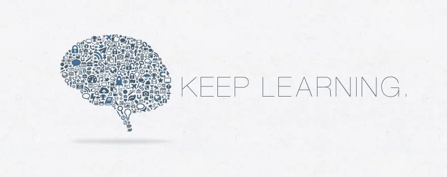

<h3>오픈소스 소사이어티 대학교</h3>

  컴퓨터 과학 무료 자체 교육 과정!

  
  

# 목차

- [요약](#summary)
- [커뮤니티](#community)
- [커리큘럼](#curriculum)
- [행동 강령](#code-of-conduct)
- [팀](#team)

# 요약

OSSU 커리큘럼은 온라인 자료를 활용한 **컴퓨터 과학 전체 교육 과정**입니다.
단순히 직업 훈련이나 전문성 개발을 위한 과정이 아닙니다.
이 과정은 모든 컴퓨팅 분야의 기본 개념에 대한 적절하고 *균형 잡힌* 기초를 원하는 사람들,
그리고 이러한 교육을 주로 스스로의 힘으로, 하지만 전 세계 동료 학습자 커뮤니티의 지원을 받으며 얻을 수 있는 규율, 의지, 그리고 (가장 중요하게는!) 좋은 습관을 가진 사람들을 위한 것입니다.

이 커리큘럼은 학부 컴퓨터 과학 전공자의 학위 요건에 따라 설계되었으며, 일반 교양 (비 CS) 요건은 제외되었습니다.
이는 이 커리큘럼을 따르는 대부분의 사람들이 이미 CS 분야 이외의 교육을 받았다고 가정하기 때문입니다.
강의 자체는 세계 최고 수준이며, 종종 하버드, 프린스턴, MIT 등에서 제공되지만,
다음 기준을 충족하도록 특별히 선택되었습니다.

**강의 필수 조건**:
- 등록 가능
- 정기적으로 운영 (이상적으로는 자율 학습 방식, 그렇지 않으면 연중 여러 차례 운영)
- 교육 자료 및 교육학적 원칙의 전반적인 품질 우수
- [CS 2013](CURRICULAR_GUIDELINES.md): 컴퓨터 과학 학부 학위 프로그램 커리큘럼 가이드라인의 커리큘럼 표준과 일치

위 기준을 충족하는 강의가 없는 경우, 교재로 보충합니다.
커리큘럼에는 맞지 않지만 품질이 우수한 강의나 책이 있는 경우,
[extras/courses](extras/courses.md) 또는 [extras/readings](extras/readings.md)에 포함됩니다.

**구성**. 커리큘럼은 다음과 같이 구성됩니다:
- *CS 입문*: 학생들이 CS를 경험해보고 자신에게 맞는지 확인할 수 있도록 함
- *핵심 CS*: 컴퓨터 과학 커리큘럼의 처음 3년에 해당하며, 모든 전공자가 필수로 수강해야 하는 과목을 다룸
- *고급 CS*: 컴퓨터 과학 커리큘럼의 마지막 해에 해당하며, 학생의 관심사에 따라 선택 과목을 수강함
- *최종 프로젝트*: 학생들이 자신의 지식을 검증, 통합 및 전시하고 전 세계 동료들로부터 평가받을 수 있는 프로젝트

**기간**. 신중하게 계획하고 주당 약 20시간을 학습에 할애한다면 약 2년 안에 마칠 수 있습니다. 학습자는 [이 스프레드시트](https://docs.google.com/spreadsheets/u/3/d/1Std_G_5dnajzm289vlsthIJPFnuxN5yOYNDOoiz9Juc/copy)를 사용하여 예상 완료 날짜를 추정할 수 있습니다. 사본을 만들고 `Timeline` 시트에 시작 날짜와 예상 주당 학습 시간을 입력하십시오. 과정을 진행하면서 `Curriculum Data` 시트에 실제 과정 완료 날짜를 입력하면 업데이트된 완료 예상치를 얻을 수 있습니다.

> **경고:** 스프레드시트는 이 커리큘럼을 완료하는 데 필요한 시간을 추정하는 데 유용한 도구이지만 항상 커리큘럼과 최신 상태가 아닐 수 있습니다. 어떤 과정을 해야 하는지 확인하려면 [OSSU CS 웹사이트](https://cs.ossu.dev) 또는 [저장소](https://github.com/ossu/computer-science)를 사용하십시오.

**비용**. 모든 또는 거의 모든 강의 자료는 무료로 제공됩니다. 그러나 일부 강의는 과제/시험/프로젝트 채점에 비용을 청구할 수 있습니다.
[Coursera](https://www.coursera.support/s/article/209819033-Apply-for-Financial-Aid-or-a-Scholarship?language=en_US)와 [edX](https://courses.edx.org/financial-assistance/) 모두 재정 지원을 제공한다는 점에 유의하십시오.

자신의 시간과 예산에 따라 지출할 금액을 결정하십시오.
성공은 돈으로 살 수 없다는 것을 기억하십시오!

**과정**. 학생들은 혼자 또는 그룹으로, 순서대로 또는 순서 없이 커리큘럼을 진행할 수 있습니다.
- 핵심 CS의 모든 강의를 수강하고, 이전에 해당 내용을 이미 학습했다고 확신하는 경우에만 강의를 건너뛰는 것이 좋습니다.
- 단순화를 위해 (특히 핵심 CS의 경우) 위에서 아래로 순서대로 강의를 진행하는 것이 좋습니다. 일부 학생들은 하루/주에 작업하는 자료를 다양화하기 위해 한 번에 여러 강의를 수강하기도 합니다. 인기 있는 옵션은 입문 과정과 병행하여 수학 과정을 수강하는 것입니다. 특정 과정에 대한 준비가 되었는지 판단하는 데 도움이 되도록 과정 선수 과목이 나열되어 있습니다.
- 고급 CS의 강의는 선택 과목입니다. 전문가가 되고 싶은 한 가지 주제(예: 고급 프로그래밍)를 선택하고 해당 제목 아래의 모든 강의를 수강하십시오. 자신만의 맞춤형 주제를 만들 수도 있습니다. Discord 커뮤니티에서 계획된 주제에 대한 피드백을 제공할 수 있습니다.

**콘텐츠 정책**. 일부 과제물을 공개적으로 보여줄 계획이라면 허용된 파일만 공유해야 합니다.
각 강의 시작 시 서명한 *행동 강령을 존중하십시오*!

**[기여 방법](CONTRIBUTING.md)**

**[도움 받기](HELP.md)** (FAQ 및 대화방에 대한 자세한 내용)

# 커뮤니티

- Discord 서버가 있습니다!  이곳은 다른 OSSU 학생들과 대화할 수 있는 첫 번째 장소여야 합니다. 지금 바로 자신을 소개해 보는 것은 어떨까요? [OSSU Discord 가입하기](https://discord.gg/wuytwK5s9h)
- GitHub 이슈를 통해서도 교류할 수 있습니다. 과정에 문제가 있거나 커리큘럼을 변경해야 하는 경우 이곳에서 대화를 시작할 수 있습니다. 자세한 내용은 [여기](CONTRIBUTING.md)에서 읽어보십시오.
- [Linkedin](https://www.linkedin.com/school/11272443/) 프로필에 **오픈소스 소사이어티 대학교**를 추가하십시오!

> **경고:** OSSU를 검색할 때 몇 가지 타사/사용되지 않는/오래된 자료를 찾을 수 있습니다. 이러한 자료는 무시하고 [OSSU CS 웹사이트](https://cs.ossu.dev) 또는 [OSSU CS Github 저장소](https://github.com/ossu/computer-science)만 사용하는 것이 좋습니다. 알려진 오래된 자료는 다음과 같습니다:
>  - 유지 관리되지 않고 사용되지 않는 Firebase 앱. 자세한 내용은 [FAQ](./FAQ.md#why-is-the-firebase-ossu-app-different-or-broken)를 참조하십시오.
>  - 유지 관리되지 않고 사용되지 않는 Trello 보드
>  - 타사 Notion 템플릿

# 커리큘럼

- [선수 과목](#prerequisites)
- [CS 입문](#intro-cs)
- [핵심 CS](#core-cs)
  - [핵심 프로그래밍](#core-programming)
  - [핵심 수학](#core-math)
  - [CS 도구](#cs-tools)
  - [핵심 시스템](#core-systems)
  - [핵심 이론](#core-theory)
  - [핵심 보안](#core-security)
  - [핵심 응용](#core-applications)
  - [핵심 윤리](#core-ethics)
- [고급 CS](#advanced-cs)
  - [고급 프로그래밍](#advanced-programming)
  - [고급 시스템](#advanced-systems)
  - [고급 이론](#advanced-theory)
  - [고급 정보 보안](#advanced-information-security)
  - [고급 수학](#advanced-math)
- [최종 프로젝트](#final-project)

---

## 선수 과목

- [핵심 CS](#core-cs)는 학생이 이미 대수학, 기하학 및 예비 미적분학을 포함한 [고등학교 수학](https://ossu.dev/precollege-math)을 이수했다고 가정합니다.
- [고급 CS](#advanced-cs)는 학생이 이미 핵심 CS 전체를 이수했으며 이제 어떤 선택 과목을 수강할지 결정할 만큼 충분한 지식을 갖추고 있다고 가정합니다.
- [고급 시스템](#advanced-systems)은 학생이 기본 물리학 과정(예: 고등학교 AP 물리학)을 이수했다고 가정합니다.

## CS 입문

이 과정은 컴퓨터 과학 및 프로그래밍의 세계를 소개합니다. 이 과정은 앞으로 나올 자료의 맛보기를 제공합니다. 과정을 마치고 더 많은 것을 원한다면 컴퓨터 과학이 당신에게 적합할 가능성이 높습니다!

**다루는 주제**:
`컴퓨팅`
`명령형 프로그래밍`
`기본 자료 구조 및 알고리즘`
`등등`

코스 | 기간 | 노력 | 선수 과목 | 토론
:-- | :--: | :--: | :--: | :--:
[파이썬을 이용한 컴퓨터 과학 및 프로그래밍 입문](coursepages/intro-cs/README.md) | 14주 | 주당 6-10시간 | [고등학교 대수학](https://ossu.dev/precollege-math) | [채팅](https://discord.gg/jvchSm9)

## 핵심 CS

핵심 CS의 모든 과정은 별도로 명시되지 않는 한 **필수**입니다.

### 핵심 프로그래밍
**다루는 주제**:
`함수형 프로그래밍`
`테스트를 위한 설계`
`프로그램 요구 사항`
`일반적인 디자인 패턴`
`단위 테스트`
`객체 지향 설계`
`정적 타이핑`
`동적 타이핑`
`ML 계열 언어 (Standard ML을 통해)`
`Lisp 계열 언어 (Racket을 통해)`
`Ruby`
`등등`

코스 | 기간 | 노력 | 선수 과목 | 토론
:-- | :--: | :--: | :--: | :--:
[체계적인 프로그램 설계](coursepages/spd/README.md) | 13주 | 주당 8-10시간 | 없음 | 채팅: [1부](https://discord.gg/RfqAmGJ) / [2부](https://discord.gg/kczJzpm)
[클래스 기반 프로그램 설계](https://course.ccs.neu.edu/cs2510sp22/index.html) | 13주 | 주당 5-10시간 | 체계적인 프로그램 설계, 고등학교 수학 | [채팅](https://discord.com/channels/744385009028431943/891411727294562314)
[프로그래밍 언어, 파트 A](https://www.coursera.org/learn/programming-languages) | 5주 | 주당 4-8시간 | 체계적인 프로그램 설계 ([강사 의견 듣기](https://www.coursera.org/lecture/programming-languages/recommended-background-k1yuh)) | [채팅](https://discord.gg/8BkJtXN)
[프로그래밍 언어, 파트 B](https://www.coursera.org/learn/programming-languages-part-b) | 3주 | 주당 4-8시간 | 프로그래밍 언어, 파트 A | [채팅](https://discord.gg/EeA7VR9)
[프로그래밍 언어, 파트 C](https://www.coursera.org/learn/programming-languages-part-c) | 3주 | 주당 4-8시간 | 프로그래밍 언어, 파트 B | [채팅](https://discord.gg/8EZUVbA)
[객체 지향 설계](https://course.ccs.neu.edu/cs3500f19/) | 13주 | 주당 5-10시간 | 클래스 기반 프로그램 설계 | [채팅](https://discord.com/channels/744385009028431943/891412022120579103)
[소프트웨어 아키텍처](https://www.coursera.org/learn/software-architecture) | 4주 | 주당 2-5시간 | 객체 지향 설계 | [채팅](https://discord.com/channels/744385009028431943/891412169638432788)

### 핵심 수학
이산 수학(CS를 위한 수학)은 선수 과목이며 알고리즘 및 자료 구조 연구와 밀접하게 관련되어 있습니다. 미적분학은 학생들을 이산 수학에 대비시키고 수학적 성숙도를 개발하는 데 도움이 됩니다.

**다루는 주제**:
`이산 수학`
`수학적 증명`
`기본 통계`
`O-표기법`
`이산 확률`
`등등`

코스 | 기간 | 노력 | 참고 | 선수 과목 | 토론
:-- | :--: | :--: | :--: | :--: | :--:
[미적분학 1A: 미분](https://openlearninglibrary.mit.edu/courses/course-v1:MITx+18.01.1x+2T2019/about) ([대안](https://ocw.mit.edu/courses/mathematics/18-01sc-single-variable-calculus-fall-2010/index.htm)) | 13주 | 주당 6-10시간 | 대안 과정은 이 과정과 다음 2개 과정을 다룹니다 | [고등학교 수학](https://ossu.dev/precollege-math) | [채팅](https://discord.gg/mPCt45F)
[미적분학 1B: 적분](https://openlearninglibrary.mit.edu/courses/course-v1:MITx+18.01.2x+3T2019/about) | 13주 | 주당 5-10시간 | - | 미적분학 1A | [채팅](https://discord.gg/sddAsZg)
[미적분학 1C: 좌표계 및 무한급수](https://openlearninglibrary.mit.edu/courses/course-v1:MITx+18.01.3x+1T2020/about) | 6주 | 주당 5-10시간 | - | 미적분학 1B | [채팅](https://discord.gg/FNEcNNq)
[컴퓨터 과학을 위한 수학](https://openlearninglibrary.mit.edu/courses/course-v1:OCW+6.042J+2T2019/about) ([대안](https://ocw.mit.edu/courses/6-042j-mathematics-for-computer-science-fall-2010/)) | 13주 | 주당 5시간 | [2015/2019 해답](https://github.com/spamegg1/Math-for-CS-solutions) [2010 해답](https://github.com/frevib/mit-cs-math-6042-fall-2010-problems) [2005 해답](https://ocw.mit.edu/courses/electrical-engineering-and-computer-science/6-042j-mathematics-for-computer-science-fall-2005/assignments/). | 미적분학 1C | [채팅](https://discord.gg/EuTzNbF)

### CS 도구
이론을 이해하는 것도 중요하지만 프로그램을 만들 것으로 예상됩니다. 그 과정을 더 쉽게 만드는 데 널리 사용되는 여러 도구가 있습니다. 지금 배워서 향후 프로그램 작성 작업을 편하게 하십시오.

**다루는 주제**:
`터미널 및 셸 스크립팅`
`vim`
`명령줄 환경`
`버전 관리`
`등등`

코스 | 기간 | 노력 | 선수 과목 | 토론
:-- | :--: | :--: | :--: | :--:
[CS 교육의 빠진 학기](https://missing.csail.mit.edu/) | 2주 | 주당 12시간 | - | [채팅](https://discord.gg/5FvKycS)

### 핵심 시스템

**다루는 주제**:
`절차적 프로그래밍`
`수동 메모리 관리`
`부울 대수`
`게이트 논리`
`메모리`
`컴퓨터 아키텍처`
`어셈블리`
`기계어`
`가상 머신`
`고급 언어`
`컴파일러`
`운영 체제`
`네트워크 프로토콜`
`등등`

코스 | 기간 | 노력 | 추가 교재/과제 | 선수 과목 | 토론
:-- | :--: | :--: | :--: | :--: | :--:
[최초 원리부터 최신 컴퓨터 구축: Nand에서 Tetris까지](https://www.coursera.org/learn/build-a-computer) ([대안](https://www.nand2tetris.org/)) | 6주 | 주당 7-13시간 | - | C 계열 프로그래밍 언어 | [채팅](https://discord.gg/vxB2DRV)
[최초 원리부터 최신 컴퓨터 구축: Nand에서 Tetris까지 파트 II](https://www.coursera.org/learn/nand2tetris2) | 6주 | 주당 12-18시간 | - | [이 프로그래밍 언어 중 하나](https://user-images.githubusercontent.com/2046800/35426340-f6ce6358-026a-11e8-8bbb-4e95ac36b1d7.png), Nand에서 Tetris까지 파트 I | [채팅](https://discord.gg/AsUXcPu)
[운영 체제: 세 가지 쉬운 부분](coursepages/ostep/README.md) | 10-12주 | 주당 6-10시간 | - | Nand에서 Tetris까지 파트 II | [채팅](https://discord.gg/wZNgpep)
[컴퓨터 네트워킹: 하향식 접근 방식](http://gaia.cs.umass.edu/kurose_ross/online_lectures.htm)| 8주 | 주당 4–12시간 | [Wireshark 실습](http://gaia.cs.umass.edu/kurose_ross/wireshark.php) | 대수학, 확률, 기본 CS | [채팅](https://discord.gg/MJ9YXyV)

### 핵심 이론

**다루는 주제**:
`분할 정복`
`정렬 및 검색`
`무작위 알고리즘`
`그래프 검색`
`최단 경로`
`자료 구조`
`탐욕 알고리즘`
`최소 신장 트리`
`동적 프로그래밍`
`NP-완전성`
`등등`

코스 | 기간 | 노력 | 선수 과목 | 토론
:-- | :--: | :--: | :--: | :--:
[분할 정복, 정렬 및 검색, 무작위 알고리즘](https://www.coursera.org/learn/algorithms-divide-conquer) | 4주 | 주당 4-8시간 | 모든 프로그래밍 언어, 컴퓨터 과학을 위한 수학 | [채팅](https://discord.gg/mKRS7tY)
[그래프 검색, 최단 경로 및 자료 구조](https://www.coursera.org/learn/algorithms-graphs-data-structures) | 4주 | 주당 4-8시간 | 분할 정복, 정렬 및 검색, 무작위 알고리즘 | [채팅](https://discord.gg/Qstqe4t)
[탐욕 알고리즘, 최소 신장 트리 및 동적 프로그래밍](https://www.coursera.org/learn/algorithms-greedy) | 4주 | 주당 4-8시간 | 그래프 검색, 최단 경로 및 자료 구조 | [채팅](https://discord.gg/dWVvjuz)
[최단 경로 재검토, NP-완전 문제 및 대처 방법](https://www.coursera.org/learn/algorithms-npcomplete) | 4주 | 주당 4-8시간 | 탐욕 알고리즘, 최소 신장 트리 및 동적 프로그래밍 | [채팅](https://discord.gg/dYuY78u)

### 핵심 보안
**다루는 주제**
`기밀성, 무결성, 가용성`
`보안 설계`
`방어적 프로그래밍`
`위협 및 공격`
`네트워크 보안`
`암호화`
`등등`

코스 | 기간 | 노력 | 선수 과목 | 토론
:-- | :--: | :--: | :--: | :--:
[사이버 보안 기초](https://www.edx.org/course/cybersecurity-fundamentals) | 8주 | 주당 10-12시간 | - | [채팅](https://discord.gg/XdY3AwTFK4)
[보안 코딩 원칙](https://www.coursera.org/learn/secure-coding-principles)| 4주 | 주당 4시간 | - | [채팅](https://discord.gg/5gMdeSK)
[보안 취약점 식별](https://www.coursera.org/learn/identifying-security-vulnerabilities) | 4주 | 주당 4시간 | - | [채팅](https://discord.gg/V78MjUS)

다음 중 **하나**를 선택하십시오:

코스 | 기간 | 노력 | 선수 과목 | 토론
:-- | :--: | :--: | :--: | :--:
[C/C++ 프로그래밍에서 보안 취약점 식별](https://www.coursera.org/learn/identifying-security-vulnerabilities-c-programming) | 4주 | 주당 5시간 | - | [채팅](https://discord.gg/Vbxce7A)
[Java 애플리케이션의 취약점 악용 및 보안](https://www.coursera.org/learn/exploiting-securing-vulnerabilities-java-applications) | 4주 | 주당 5시간 | - | [채팅](https://discord.gg/QxC22rR)

### 핵심 응용

**다루는 주제**:
`애자일 방법론`
`REST`
`소프트웨어 사양`
`리팩토링`
`관계형 데이터베이스`
`트랜잭션 처리`
`데이터 모델링`
`신경망`
`지도 학습`
`비지도 학습`
`OpenGL`
`광선 추적`
`등등`

코스 | 기간 | 노력 | 선수 과목 | 토론
:-- | :--: | :--: | :--: | :--:
[데이터베이스: 모델링 및 이론](https://www.edx.org/course/modeling-and-theory)| 2주 | 주당 10시간 | 핵심 프로그래밍 | [채팅](https://discord.gg/pMFqNf4)
[데이터베이스: 관계형 데이터베이스 및 SQL](https://www.edx.org/course/databases-5-sql)| 2주 | 주당 10시간 | 핵심 프로그래밍 | [채팅](https://discord.gg/P8SPPyF)
[데이터베이스: 반정형 데이터](https://www.edx.org/course/semistructured-data)| 2주 | 주당 10시간 | 핵심 프로그래밍 | [채팅](https://discord.gg/duCJ3GN)
[머신 러닝](https://www.coursera.org/specializations/machine-learning-introduction)| 11주 | 주당 9시간 | 기본 코딩 | [채팅](https://discord.gg/NcXHDjy)
[컴퓨터 그래픽스](https://www.edx.org/course/computer-graphics-2) ([대안](https://cseweb.ucsd.edu/~viscomp/classes/cse167/wi22/schedule.html))| 6주 | 주당 12시간 | C++ 또는 Java, [기본 선형 대수학](https://ossu.dev/precollege-math/coursepages/precalculus) | [채팅](https://discord.gg/68WqMNV)
[소프트웨어 공학: 입문](https://www.edx.org/learn/software-engineering/university-of-british-columbia-software-engineering-introduction) ([대안](https://github.com/ubccpsc/310/blob/main/resources/README.md)) | 6주 | 주당 8-10시간 | 핵심 프로그래밍 및 [상당한 규모의 프로젝트](FAQ.md#why-require-experience-with-a-sizable-project-before-the-Software-Engineering-courses) | [채팅](https://discord.gg/5Qtcwtz)

### 핵심 윤리

**다루는 주제**:
`사회적 맥락`
`분석 도구`
`전문 윤리`
`지적 재산권`
`개인 정보 보호 및 시민의 자유`
`등등`

코스 | 기간 | 노력 | 선수 과목 | 토론
:-- | :--: | :--: | :--: | :--:
[윤리, 기술 및 공학](https://www.coursera.org/learn/ethics-technology-engineering)| 9주 | 주당 2시간 | 없음 | [채팅](https://discord.gg/6ttjPmzZbe)
[지적 재산권 소개](https://www.coursera.org/learn/introduction-intellectual-property)| 4주 | 주당 2시간 | 없음 | [채팅](https://discord.gg/YbuERswpAK)
[데이터 개인 정보 보호 기초](https://www.coursera.org/learn/northeastern-data-privacy)| 3주 | 주당 3시간 | 없음 | [채팅](https://discord.gg/64J34ajNBd)

## 고급 CS

핵심 CS의 **모든 필수 과정**을 마친 후, 학생들은 관심사에 따라 고급 CS에서 과정의 일부를 선택해야 합니다.
하위 범주의 모든 과정을 수강할 필요는 없습니다.
그러나 학생들은 자신이 진출하려는 분야와 관련된 *모든* 과정을 수강해야 합니다.

### 고급 프로그래밍

**다루는 주제**:
`디버깅 이론 및 실제`
`목표 지향 프로그래밍`
`병렬 컴퓨팅`
`객체 지향 분석 및 설계`
`UML`
`대규모 소프트웨어 아키텍처 및 설계`
`등등`

코스 | 기간 | 노력 | 선수 과목
:-- | :--: | :--: | :--:
[병렬 프로그래밍](https://www.coursera.org/learn/scala-parallel-programming)| 4주 | 주당 6-8시간 | Scala 프로그래밍
[컴파일러](https://www.edx.org/course/compilers) | 9주 | 주당 6-8시간 | 없음
[Haskell 소개](https://www.seas.upenn.edu/~cis194/fall16/)| 14주 | - | -
[지금 Prolog 배우기!](https://www.let.rug.nl/bos/lpn//lpnpage.php?pageid=online) ([대안](https://github.com/ossu/computer-science/files/6085884/lpn.pdf))*| 12주 | - | -
[소프트웨어 디버깅](https://www.youtube.com/playlist?list=PLAwxTw4SYaPkxK63TiT88oEe-AIBhr96A)| 8주 | 주당 6시간 | 파이썬, 객체 지향 프로그래밍
[소프트웨어 테스팅](https://www.youtube.com/playlist?list=PLAwxTw4SYaPkWVHeC_8aSIbSxE_NXI76g) | 4주 | 주당 6시간 | 파이썬, 프로그래밍 경험

(*) Blackburn, Bos, Striegnitz의 저서 ([출처](https://github.com/LearnPrologNow/lpn)에서 컴파일, [CC 라이선스](https://creativecommons.org/licenses/by-sa/4.0/)에 따라 재배포)

### 고급 시스템

**다루는 주제**:
`디지털 신호`
`조합 논리`
`CMOS 기술`
`순차 논리`
`유한 상태 기계`
`프로세서 명령어 집합`
`캐시`
`파이프라이닝`
`가상화`
`병렬 처리`
`가상 메모리`
`동기화 기본 요소`
`시스템 호출 인터페이스`
`등등`

코스 | 기간 | 노력 | 선수 과목 | 참고
:-- | :--: | :--: | :--: | :--:
[계산 구조 1: 디지털 회로](https://learning.edx.org/course/course-v1:MITx+6.004.1x_3+3T2016) [대안 1](https://ocw.mit.edu/courses/6-004-computation-structures-spring-2017/) [대안 2](https://ocw.mit.edu/courses/6-004-computation-structures-spring-2009/) | 10주 | 주당 6시간 | [Nand2Tetris II](https://www.coursera.org/learn/nand2tetris2) | 대안 링크에는 3개 과정이 모두 포함되어 있습니다.
[계산 구조 2: 컴퓨터 아키텍처](https://learning.edx.org/course/course-v1:MITx+6.004.2x+3T2015) | 10주 | 주당 6시간 | 계산 구조 1 | -
[계산 구조 3: 컴퓨터 구성](https://learning.edx.org/course/course-v1:MITx+6.004.3x_2+1T2017) | 10주 | 주당 6시간 | 계산 구조 2 | -

### 고급 이론

**다루는 주제**:
`형식 언어`
`튜링 기계`
`계산 가능성`
`이벤트 기반 동시성`
`오토마타`
`분산 공유 메모리`
`합의 알고리즘`
`상태 기계 복제`
`계산 기하학 이론`
`명제 논리`
`관계 논리`
`헤르브란트 논리`
`게임 트리`
`등등`

코스 | 기간 | 노력 | 선수 과목
:-- | :--: | :--: | :--:
[계산 이론](https://ocw.mit.edu/courses/18-404j-theory-of-computation-fall-2020/) ([대안](https://www.youtube.com/playlist?list=PLEE7DF8F5E0203A56)) | 13주 | 주당 10시간 | [컴퓨터 과학을 위한 수학](https://openlearninglibrary.mit.edu/courses/course-v1:OCW+6.042J+2T2019/about), 논리학, 알고리즘
[계산 기하학](https://www.edx.org/course/computational-geometry) | 16주 | 주당 8시간 | 알고리즘, C++
[게임 이론](https://www.coursera.org/learn/game-theory-1) | 8주 | 주당 3시간 | 수학적 사고, 확률, 미적분학

### 고급 정보 보안

코스 | 기간 | 노력 | 선수 과목
:-- | :--: | :--: | :--:
[웹 보안 기초](https://www.edx.org/course/web-security-fundamentals) | 5주 | 주당 4-6시간 | 기본 웹 기술 이해
[보안 거버넌스 및 규정 준수](https://www.coursera.org/learn/security-governance-compliance) | 3주 | 주당 3시간 | -
[디지털 포렌식 개념](https://www.coursera.org/learn/digital-forensics-concepts) | 3주 | 주당 2-3시간 | 핵심 보안
[보안 소프트웨어 개발: 요구 사항, 설계 및 재사용](https://www.edx.org/course/secure-software-development-requirements-design-and-reuse) | 7주 | 주당 1-2시간 | 핵심 프로그래밍 및 핵심 보안
[보안 소프트웨어 개발: 구현](https://www.edx.org/course/secure-software-development-implementation) | 7주 | 주당 1-2시간 | 보안 소프트웨어 개발: 요구 사항, 설계 및 재사용
[보안 소프트웨어 개발: 검증 및 기타 전문 주제](https://www.edx.org/course/secure-software-development-verification-and-more-specialized-topics) | 7주 | 주당 1-2시간 | 보안 소프트웨어 개발: 구현

### 고급 수학

코스 | 기간 | 노력 | 선수 과목 | 토론
:-- | :--: | :--: | :--: | :--:
[선형 대수학의 본질](https://www.youtube.com/playlist?list=PLZHQObOWTQDPD3MizzM2xVFitgF8hE_ab) | - | - | [고등학교 수학](https://ossu.dev/precollege-math) | [채팅](https://discord.gg/m6wHbP6)
[선형 대수학](https://ocw.mit.edu/courses/mathematics/18-06sc-linear-algebra-fall-2011/) | 14주 | 주당 12시간 | 선수 과목: 선형 대수학의 본질 | [채팅](https://discord.gg/k7nSWJH)
[수치 해석 입문](https://ocw.mit.edu/courses/mathematics/18-335j-introduction-to-numerical-methods-spring-2019/index.htm)| 14주 | 주당 12시간 | [선형 대수학](https://ocw.mit.edu/courses/mathematics/18-06sc-linear-algebra-fall-2011/) | [채팅](https://discord.gg/FNEcNNq)
[형식 논리 입문](https://forallx.openlogicproject.org/) | 10주 | 주당 4-8시간 | [집합론](https://www.youtube.com/playlist?list=PL5KkMZvBpo5AH_5GpxMiryJT6Dkj32H6N) | [채팅](https://discord.gg/MbM2Gg5)
[확률](https://stat110.hsites.harvard.edu/) | 15주 | 주당 5-10시간 | [미분과 적분](https://www.edx.org/course/calculus-1b-integration) | [채팅](https://discord.gg/UVjs9BU)

## 최종 프로젝트

배움의 일부는 실행입니다.
각 과정의 과제와 시험은 실제 문제를 해결하기 위해 지식을 사용하는 방법을 준비하기 위한 것입니다.

핵심 CS와 관련된 고급 CS 부분을 완료한 후,
습득한 지식을 사용하여 해결할 수 있는 문제를 식별해야 합니다.
완전히 새로운 것을 만들거나 사용하는 도구/프로그램 중 개선되기를 바라는 것을 개선할 수 있습니다.

프로젝트 생성에 대한 추가 지침을 원하는 학생은 일련의 프로젝트 중심 과정을 사용할 수 있습니다.
다음은 옵션 샘플입니다.
(더 많은 옵션이 있으며, 이 시점에서는 자신에게 흥미롭고 관련된 시리즈를 식별할 수 있어야 합니다):

코스 | 기간 | 노력 | 선수 과목
:-- | :--: | :--: | :--:
[풀스택 오픈](https://fullstackopen.com/en/) | 12주 | 주당 15시간 | 프로그래밍
[현대 로봇공학 (전문 과정)](https://www.coursera.org/specializations/modernrobotics) | 26주 | 주당 2-5시간 | 신입생 수준 물리학, 선형 대수학, 미적분학, [선형 상미분 방정식](https://www.khanacademy.org/math/differential-equations)
[데이터 마이닝 (전문 과정)](https://www.coursera.org/specializations/data-mining) | 30주 | 주당 2-5시간 | 머신 러닝
[빅 데이터 (전문 과정)](https://www.coursera.org/specializations/big-data) | 30주 | 주당 3-5시간 | 없음
[사물 인터넷 (전문 과정)](https://www.coursera.org/specializations/internet-of-things) | 30주 | 주당 1-5시간 | 강력한 프로그래밍
[클라우드 컴퓨팅 (전문 과정)](https://www.coursera.org/specializations/cloud-computing) | 30주 | 주당 2-6시간 | C++ 프로그래밍
[데이터 과학 (전문 과정)](https://www.coursera.org/specializations/jhu-data-science) | 43주 | 주당 1-6시간 | 없음
[Scala를 사용한 함수형 프로그래밍 (전문 과정)](https://www.coursera.org/specializations/scala) | 29주 | 주당 4-5시간 | 1년 프로그래밍 경험
[Unity 2020을 사용한 게임 디자인 및 개발 (전문 과정)](https://www.coursera.org/specializations/game-design-and-development) | 6개월 | 주당 5시간 | 프로그래밍, 인터랙티브 디자인

## 축하합니다

위 커리큘럼의 요구 사항을 완료하면
컴퓨터 과학 학사 학위 전체에 해당하는 과정을 마치게 됩니다.
축하합니다!

다음 단계는 무엇일까요? 가능성은 무한하며 중복됩니다:

- 개발자로 취업하십시오!
- 기술을 연마하고 지식을 넓힐 수 있는 고전 도서에 대한 [읽을거리](extras/readings.md)를 확인하십시오.
- 지역 개발자 모임에 참여하십시오 (예: [meetup.com](https://www.meetup.com/)을 통해).
- 소프트웨어 개발 세계의 새로운 기술에 주목하십시오:
  + 검증된 Erlang 가상 머신을 기반으로 하는 웹을 위한 새로운 함수형 프로그래밍 언어인 [Elixir](https://elixir-lang.org/)를 통해 **액터 모델**을 탐색하십시오!
  + 가비지 수집기 없이 메모리 및 스레드 안전성을 달성하는 시스템 언어인 [Rust](https://www.rust-lang.org/)를 통해 **소유권 및 수명**을 탐색하십시오!
  + 유형 기반 개발을 위한 전례 없는 지원을 제공하는 새로운 Haskell 기반 언어인 [Idris](https://www.idris-lang.org/)를 통해 **종속 유형 시스템**을 탐색하십시오.

# 행동 강령
[OSSU 행동 강령](https://github.com/ossu/code-of-conduct).

## 진행 상황을 보여주는 방법

[GitHub 저장소](https://github.com/ossu/computer-science)를 자신의 GitHub 계정으로 [포크](https://www.freecodecamp.org/news/how-to-fork-a-github-repository/)하고 완료한 항목 옆에 ✅ 표시를 하십시오. 이것은 [칸반 보드](https://en.wikipedia.org/wiki/Kanban_board) 역할을 할 수 있으며 다른 어떤 솔루션보다 빠르게 구현할 수 있습니다 (과정에 시간을 할애할 수 있도록 함).

# 팀

* **[Eric Douglas](https://github.com/ericdouglas)**: OSSU 설립자
* **[Josh Hanson](https://github.com/joshmhanson)**: 수석 기술 유지 관리자
* **[Waciuma Wanjohi](https://github.com/waciumawanjohi)**: 수석 학술 유지 관리자
* **[기여자](https://github.com/ossu/computer-science/graphs/contributors)**
