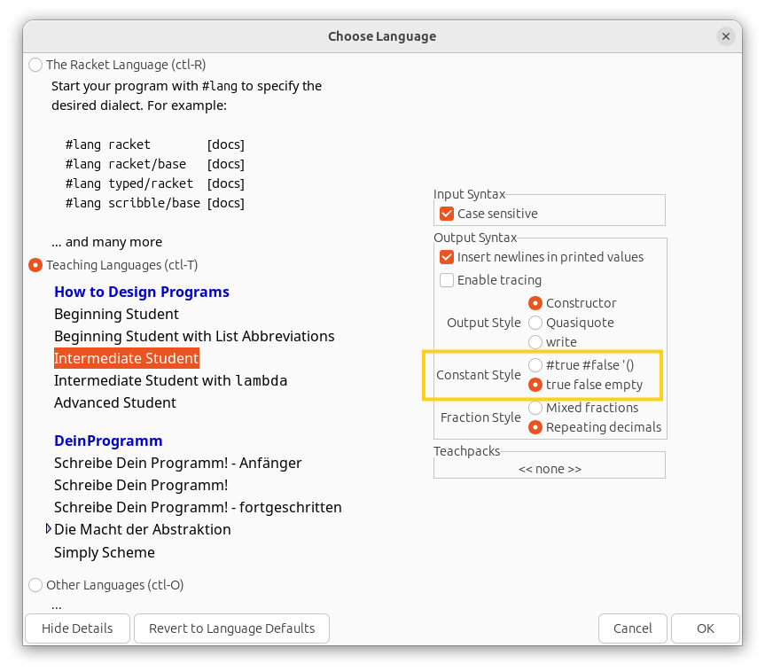
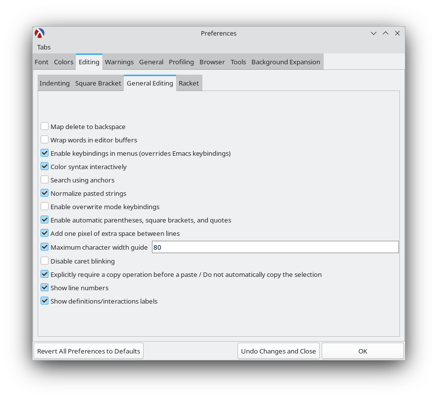

# 체계적인 프로그램 설계 (Systematic Program Design)

이 과정은 UBC에서 개발했으며 Edx에서 제공됩니다. Edx의 보관된 버전을 수강하는 것을 권장합니다.

> 이 프로그래밍 과정은 프로그래밍 언어보다는 체계적인 프로그래밍 방법을 배우는 데 중점을 둔 독특한 접근 방식을 취합니다. 이 실용적인 접근 방식은 창의력을 발휘하여 어떤 언어로든 훌륭하게 프로그래밍할 수 있도록 도와줄 것입니다.

**강의 링크 (권장):** <https://learning.edx.org/course/course-v1:UBCx+SPD1x+2T2015>

대안 링크:

- <https://www.edx.org/course/how-to-code-simple-data> (6A주차까지)
- <https://www.edx.org/course/how-to-code-complex-data> (6B주차부터)

## 지침

**참고:** 이 지침은 권장하는 Edx의 보관된 과정 버전에 대한 것입니다. 다른 버전의 과정에는 적용되지 않습니다.

- 이 과정은 Edx에 홈페이지가 없지만 걱정하지 마십시오. 위에 제공된 [링크](https://learning.edx.org/course/course-v1:UBCx+SPD1x+2T2015)를 열고 로그인(로그인하지 않은 경우)한 다음 과정에 등록하십시오.
- 과정 개요에 나와 있는 대로 1A주차부터 6A주차까지 진행합니다. 비디오를 시청하고 연습 문제를 풀고 문제 은행의 문제를 해결합니다.
- 6A주차를 완료한 후 [스페이스 인베이더 문제](https://github.com/ossu/spd-starters/blob/main/final/space-invaders-starter.rkt)를 해결합니다. 자세한 지침은 여기에서 찾을 수 있습니다: [스페이스 인베이더 지침](space-invaders-instructions.png). 게임 샘플 실행은 [여기](https://www.youtube.com/shorts/wUg3psZl7vM)에서 볼 수 있습니다.
- 그런 다음 6B주차부터 계속 진행합니다. 비디오를 시청하고 연습 문제를 풀고 문제 은행의 문제를 해결합니다.
- 그 후 [이 재생 목록](https://www.youtube.com/playlist?list=PL6NenTZG6KrqdcyTwGf09uBxjI5pbXuT7)의 추가 비디오를 시청합니다.
- 과정의 모든 모듈을 완료한 후 [TA 해결사 문제](https://github.com/ossu/spd-starters/blob/main/final/ta-solver-starter.rkt)를 해결합니다. 시작 파일에서 지침을 찾을 수 있습니다.
- 문제 은행 탭에는 많은 추가 문제가 있습니다. 이해도를 높이기 위해 모든 문제를 해결하는 것이 좋습니다.
- 과정의 일부 시작 파일 링크가 더 이상 작동하지 않습니다. 이 github 저장소에서 시작 파일을 다운로드할 수 있습니다: <https://github.com/ossu/spd-starters>. [이 링크](https://github.com/ossu/spd-starters/archive/refs/heads/main.zip)를 사용하여 모든 시작 파일의 zip 파일을 다운로드할 수 있습니다.
- 연습 문제에 대한 답변을 제출할 수는 없지만 "답변 보기"를 클릭하여 답을 볼 수 있습니다. 정직하게 답을 확인하십시오.
- 문제 은행 문제를 제출할 수는 없지만 샘플 솔루션을 제공합니다. 자신의 솔루션과 비교할 수 있습니다.
- 다른 IDE에서 이 과정을 수행하는 방법이 있지만, 다른 IDE용 문제 시작 파일을 구성하는 것은 노력할 가치가 없으므로 Dr. Racket을 사용하는 것이 좋습니다.
- 막히는 부분이 있으면 언제든지 질문하십시오. 이 과정에 대한 OSSU 채팅방에 여기에서 참여할 수 있습니다:
  - 6A주차까지의 토론을 위한 채팅: <https://discord.gg/RfqAmGJ>
  - 6B주차부터의 토론을 위한 채팅: <https://discord.gg/kczJzpm>

## 참고

- Dr. Racket은 기본적으로 최신 표기법 `#true #false '()`을 사용합니다. 메뉴 표시줄에서 언어 > 언어 선택을 클릭하여 과정에서 사용하는 표기법을 사용하도록 Dr. Racket을 구성할 수 있습니다. 그런 다음 필요한 언어(BSL, ISL 또는 기타 변형)를 선택합니다. 그런 다음 창 왼쪽 하단의 "세부 정보 표시"를 클릭합니다. 그런 다음 "상수 스타일" 필드에서 `true false empty`를 선택합니다. 새 구성을 사용하는지 확인하기 위해 파일을 다시 실행하십시오.

- 괄호, 대괄호 및 따옴표 자동 닫기를 활성화할 수 있습니다. 메뉴 표시줄에서 편집 > 환경 설정을 클릭합니다. > 편집 탭으로 이동합니다. > 일반 편집 하위 탭으로 이동합니다. > "괄호, 대괄호 및 따옴표 자동 닫기 활성화" 확인란을 선택합니다.

- Ctrl + I를 사용하여 전체 파일의 들여쓰기를 다시 할 수 있습니다.

- Windows 또는 Linux를 사용하는 경우 Alt + Backspace를 사용하여 전체 단어를 삭제하십시오.

- 어떤 이유로든 Edx에서 비디오를 시청할 수 없는 경우 [이 유튜브 채널](https://www.youtube.com/@systematicprogramdesign7962/playlists)에서 시청할 수 있습니다.

## 자주 묻는 질문 (FAQ)

### 이 과정은 지루합니다. 건너뛰어도 되나요?

**아니요.** 이 과정은 처음에는 지루해 보일 수 있지만, 꾸준히 진행하는 것이 좋습니다. 이 과정은 훌륭하며 아마도 여러분의 사고방식을 바꿀 것입니다. 처음에는 이 과정이 지루하다고 생각했던 많은 학생들이 과정을 마칠 때쯤에는 이 과정의 팬이 되었습니다. 매우 주의하십시오. 초기 부분(특히 평가 작동 방식에 대한 규칙)은 나머지 과정에서 코드가 어떻게 작동하고 실행되는지 이해하는 데 큰 역할을 합니다.

### 이 과정은 왜 BSL을 사용하여 진행되나요? 업계 표준 언어로 가르치는 것이 더 합리적이지 않을까요?

이것은 의도적인 선택이며 이유는 다음과 같습니다.

1. 리스프는 컴퓨터 과학자들의 공용어입니다. 즉, PhD 알고리즘 연구자들을 의미합니다. 여기에는 몇 가지 좋은 이유와 단순히 역사적인 이유가 있지만, 이는 현실이므로 백서를 읽고 싶다면 리스프를 읽고 싶을 것입니다. BSL은 좋은 입문 과정이며, 솔직히 괄호 지옥을 극복하고 리스프를 알게 되면 모든 리스프를 읽는 방법을 알게 됩니다.

2. 이것은 대부분의 사람들 커리큘럼에서 언어 사용법을 가르치는 데 중점을 두지 않는 첫 번째 컴퓨터 과학 과정입니다. 컴퓨터 과학의 요점은 언어를 가르치는 것이 아니기 때문입니다. 또는 코딩을 가르치는 것도 아닙니다. 또는 풀스택 소프트웨어 엔지니어가 되도록 가르치는 것도 아닙니다. 컴퓨터 과학은 광범위한 실제 사용 사례를 가진 매우 좁게 적용되는 응용 수학입니다. 하지만 모든 수식어를 제거하면 수학입니다. 즉, 구현 언어와 완전히 독립적인 특정 포괄적인 규칙이 있다는 의미입니다.

이 과정은 일회용 학생용 언어로 만들어졌으며, 특히 언어에 집중하지 않고 언어로 무엇을 하고 있는지에 집중하도록 하기 위함입니다. 우리는 public static void main이나 PEP8 스타일에 신경 쓰지 않습니다. 우리는 어떤 언어로든 프로그램을 구성하는 방법을 보고 싶습니다. 따라서 Java를 독특하게 만드는 것, Python을 독특하게 만드는 것에 집중하지 않고 코드를 더 좋게 만드는 것에 집중합니다.

이 과정을 수강하기 위해 새로운 언어를 배우는 것이 어려워 보일 수 있지만, BSL은 스타일 린팅, 런타임 문제, 코드 구획화, 컴파일 또는 코딩 환경에 대해 걱정할 필요가 없도록 해줍니다. 이것은 선물입니다. 받아들이십시오. 디자인 패턴은 충분히 어렵습니다.

### 왜 HTC, SPD와 같이 다른 과정 버전이 있나요? 왜 보관된 버전을 권장하나요?

사람들이 이러한 과정을 수강하는 데에는 두 가지 이유가 있습니다.

- 지식
- 수료증

OSSU는 여러분이 지식을 위해 참여한다고 가정합니다. 지식은 무료로 얻을 수 있습니다. 지식을 위해 참여한다면 숙제를 제출할 필요가 없습니다. 숙제를 하기만 하면 됩니다.

자신이 그 일을 했다는 인정을 받고 싶다면 수료증을 위해 참여하는 것입니다. 수료증은 무료로 받을 수 없습니다. 비용을 지불해야 합니다.

수료증을 위해 참여하는 것이 아니라면 숙제 세트를 제출할 이유가 없습니다. 만약 그렇다면 SPD 과정에서 실제로 수료증을 받을 수 없으므로(과정이 만료되었기 때문에) 잘못 찾아오신 것입니다.

수료증을 원한다면 How To Code를 수강하고 비용을 지불해야 합니다.

하지만 OSSU에서는 아무것도 지불할 필요가 없습니다. 정보 접근성이 더 좋고(과정이 만료되었기 때문에) 지식을 얻기에 충분하므로 SPD를 수강하는 것이 좋습니다.

요약:

    지식을 원한다면 SPD를 수강하십시오. -- 무료이지만 비활성 상태입니다.
    수료증을 원한다면 How To Code를 수강하고 비용을 지불하십시오. -- 여전히 활성 과정입니다.

### 이 과정을 다른 프로그래밍 언어로 수강할 수 있나요?

이 과정은 사용하는 프로그래밍 언어와 매우 통합되어 있습니다. 과정에서 지정한 언어를 사용하는 것이 좋습니다. 이 과정에서 배우는 개념은 어디에나 적용할 수 있지만, 다른 언어로 과정을 수강하려고 하는 것은 그다지 합리적이지 않으며 시간 낭비로 이어질 뿐입니다.

### 다른 IDE를 사용해도 되나요? Dr. Racket이 마음에 들지 않습니다.

이 과정의 프로그램은 코드에 그림과 서식 있는 텍스트 블록을 포함하므로 다른 IDE에서는 파일을 열 수 없습니다. 다른 IDE에서 사용할 수 있도록 시작 파일을 준비하는 것은 가능하지만 이를 위해서는 Dr. Racket이 필요하며, 그렇게 하는 데 필요한 시간은 과정에서 가르치는 개념을 배우는 데 더 잘 활용될 수 있습니다.

### 임의의 값을 출력해야 하는 함수는 어떻게 테스트하나요?

`check-random`을 사용하여 해당 함수를 테스트할 수 있습니다. [여기](https://docs.racket-lang.org/htdp-langs/beginner-abbr.html#(form._((lib._lang%2Fhtdp-beginner-abbr..rkt)._check-random)))에서 자세히 알아볼 수 있습니다. 스페이스 인베이더 프로젝트에 필요합니다.

## 크레딧

문제 시작 파일과 스페이스 인베이더 지침은 Edx의 ["Systematic Program Design" 과정](https://learning.edx.org/course/course-v1:UBCx+SPD1x+2T2015)에서 가져왔으며 [CC BY-NC-SA](https://creativecommons.org/licenses/by-nc-sa/4.0/) 라이선스가 적용됩니다.
