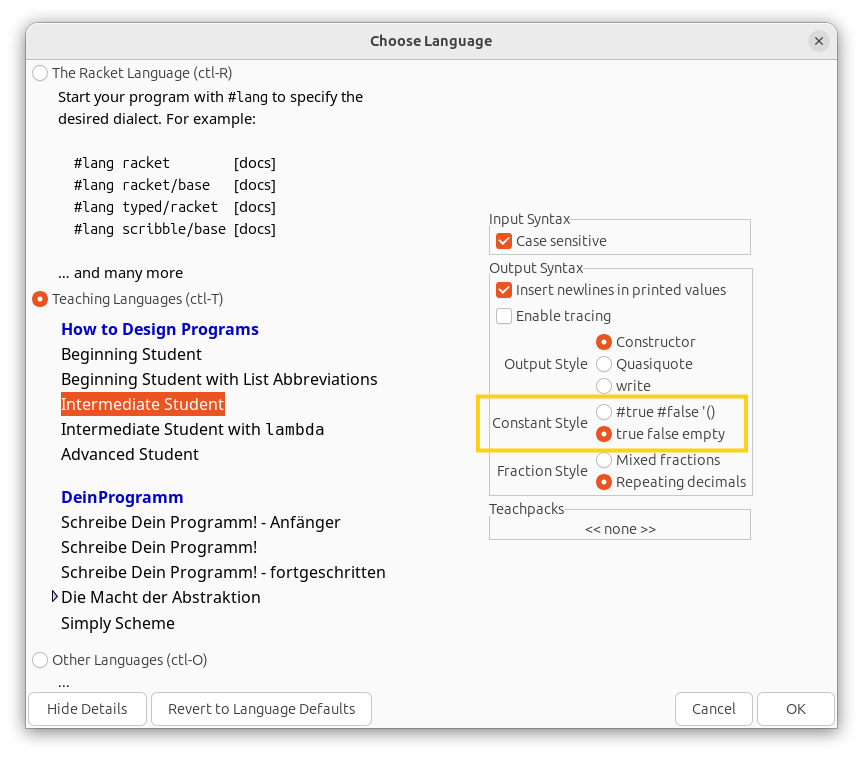
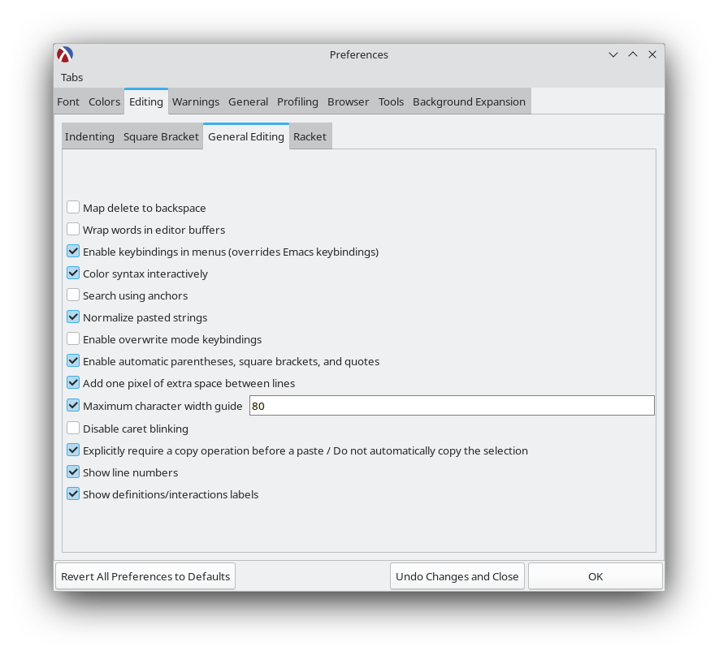

# 체계적인 프로그램 설계 (Systematic Program Design)

이 과정은 UBC에서 개발하였으며 Edx를 통해 이용할 수 있습니다. Edx에 아카이브된 버전을 이수하는 것을 권장합니다.

> 이 프로그래밍 과정은 거대한 프로그래밍 언어의 문법을 학습하는 것보다는 "체계적으로 프로그래밍하는 방법"에 집중하는 독특한 접근 방식을 취합니다. 이 실용적인 접근법은 여러분의 창의성을 좋은 방향으로 유도하여, 향후 어떤 언어로든 훌륭히 코딩할 수 강한 능력을 키워줄 것입니다.

**강좌 링크 (권장):**

- <https://learning.edx.org/course/course-v1:UBCx+SPD1x+2T2015>
- <https://learning.edx.org/course/course-v1:UBCx+SPD2x+2T2015>
- <https://learning.edx.org/course/course-v1:UBCx+SPD3x+3T2015>

대체 링크:

- <https://www.edx.org/learn/coding/university-of-british-columbia-how-to-code-simple-data> (Week 6A 이전까지)
- <https://www.edx.org/learn/coding/university-of-british-columbia-how-to-code-complex-data> (Week 6B 이후부터)

다양한 코스 버전에 대한 설명은 아래 FAQ를 참조해 주세요.

## 지시 사항

**참고:** 이 지시 사항들은 저희가 가장 권장하는 Edx 아카이브 버전에 최적화되어 있습니다. 타 버전에는 완벽히 부합하지 않을 수 있습니다.

- 이 강좌는 Edx에 별도의 공식 홈페이지가 마련되어 있지 않지만 걱정할 필요 없습니다. 위의 [링크](https://learning.edx.org/course/course-v1:UBCx+SPD1x+2T2015)를 열고 로그인한 뒤 해당 강의 수강 신청(enroll) 버튼을 누르면 그만입니다.
- 강의 개요에 따라 Week 1A부터 Week 6A까지 착실히 진도를 나가십시오. 영상을 보고 문제들을 처리한 후 문제은행(problem bank)에 돌입해 전부 해치워보세요.
- Week 6A 이수가 완료되었다면 드디어 [스페이스 인베이더(space invaders) 미션](https://github.com/ossu/spd-starters/blob/main/final/space-invaders-starter.rkt)을 완수하십시오. 미션 디테일 지침은 다음 링크에 정리되어 있습니다: [스페이스 인베이더 지시 사항](space-invaders-instructions.png). 완성되어 돌아가는 게임 예시본은 [이곳에서 시청 가능합니다](https://www.youtube.com/shorts/wUg3psZl7vM).
- 그리고 Week 6B 이후부터의 후방 학습을 이어 나갑니다. 마찬가지로 영상 시청 후 연습 문제를 해결, 문제은행을 풀이하시면 됩니다.
- 그 뒤에 [이 재생목록](https://www.youtube.com/playlist?list=PL6NenTZG6KrqdcyTwGf09uBxjI5pbXuT7)에 있는 추가 부록 영상들을 모조리 섭렵하십시오.
- 코스의 모든 모듈을 끝마쳤다면 대망의 [TA solver 미션](https://github.com/ossu/spd-starters/blob/main/final/ta-solver-starter.rkt)을 풀어보세요. 해결 단서는 시작 파일 안에 모두 내재되어 있습니다.
- 문제은행 탭에는 무수히 쏟아지는 난도 높은 예제들이 준비되어 있으니 모두 소화해 이해도를 대폭 키워보는 것을 강력 권장합니다.
- 예전 강의다 보니 군데군데 끊어진 깨진 시작 파일 링크들이 있을 수 있으니 당황하지 마시고 이 깃허브 저장소를 찾으시면 됩니다: <https://github.com/ossu/spd-starters>. 귀찮다면 [이 링크](https://github.com/ossu/spd-starters/archive/refs/heads/main.zip) 한 방으로 압축 zip 파일로 모든 걸 한번에 받을 수 있습니다.
- 온라인 채점 방식처럼 작성 파일을 제출할 곳은 닫혀 없으나, "Show Answer"란 버튼을 통해 해답 코드를 곧장 조회할 수 있습니다. 스스로 양심껏 비교하며 채점하십시오.
- 문제은행 역시 제출구는 없지만 예시 정답 모범 코드를 지원하니 자신의 답안이 올바른 방향으로 나아갔는지 대조할 수 있습니다.
- 타 IDE를 고집할 길도 없진 않지만 제발 Dr. Racket을 이용하십시오. 다른 툴에 프로젝트 세팅하느라 헛힘 쓸 시간에 Dr. Racket으로 곧바로 강의를 편안히 한 편 더 보는 게 이득입니다.
- 정 안 풀려서 곤혹스럽다면 다음과 같은 OSSU 구조선 커뮤니티 채팅방에 합류하세요:
  - Week 6A 이전 범위 관련 채널: <https://discord.gg/RfqAmGJ>
  - Week 6B 이후 후반 범위 관련 채널: <https://discord.gg/kczJzpm>

## 노트

- Dr. Racket의 최신 표기법은 `#true #false '()`가 디폴트로 되어 있습니다. 강좌의 구 방식 표기법인 `true false empty`로 전환하고 싶다면 상단 메뉴에서 Language > Choose Language를 누르세요. 그리고 해당 언어 조건(BSL, ISL 등)을 찾은 후 창 왼쪽 구석에 박힌 "Show details" 버튼을 눌러 Constant Style 필드를 `true false empty` 로 재적용시키고 실행해 주면 변경 내역이 완벽히 고정됩니다.

- 귀찮은 괄호의 짝이 저절로 닫히게 하는 마법, Edit > Preferences > Editing 탭 > General Editing 서브 메뉴 순으로 타고 들어가 "Enable automatic parentheses, square brackets, and quotes" 항목만 체크해 주면 끝입니다.

- Ctrl + I 핫키 입력 하나로 더러운 코드 인덴트(들여쓰기)를 싹 다 아름답게 일직선으로 재졍렬할 수 있습니다.
- 윈도우/리눅스 유저라면 Alt + Backspace 스킬을 구사하여 단어 뭉텅이를 통째로 썰어낼 수 있습니다.
- 만약 모종의 오류로 인해 Edx 영상이 죽고 재생이 먹통이라면 당황하지 않고 [이 공식 유튜브 피난처](https://www.youtube.com/@systematicprogramdesign7962/playlists)에서 전 강의를 이어 볼 수 있습니다.

## FAQ

### 이 코스는 너무 지루해요. 건너뛰면 안 되나요?

**안 됩니다.** 초반에는 졸음이 쏟아질 정도로 단조롭게 다가올 수 있습니다. 하지만 이 강좌는 당신이 사고하는 뇌 구조 자체를 뜯어고쳐버릴 대단한 파급력을 지녔습니다. 처음에 투덜거리던 많은 학생들이 과정의 대단원이 막을 내릴 무렵엔 극단적 찬양론자로 둔갑하는 현상이 수없이 목격되어 왔습니다. 특히 극초반 파트 (평가 규칙이 돌아가는 원리 등)를 가볍게 여겼다간 두고두고 큰 화를 면치 못할 것입니다. 바로 코드가 본질적으로 어찌 돌아가는지 메커니즘을 뚫어볼 핵심 교본이기 때문입니다.

### 왜 하필 업계 밖의 언어인 BSL(Lisp 계열)로 강의를 진행하나요?

다분히 악의적이고도 의도적인 배분이며 그 이유는 다음과 같습니다:

1. Lisp은 컴퓨터 과학계(PhD 논문 연구원 등)의 절대 공용어나 다름없습니다. 어쭙잖은 변명이 아닌 팩트입니다. 미래에 전문적인 알고리즘 논문 한 편이라도 읽으려면 Lisp의 무덤을 무조건 기어 다녀야만 합니다. BSL은 끔찍한 그 괄호 모양새 지옥을 이겨내고 Lisp 계열 언어 구사에 면역력을 키워줄 최고의 백신입니다.
2. 프로그래밍 특화 기술(특정 언어 구사 등)을 목표로 하지 않는 최초의 수업이 될 것입니다. 컴퓨터 과학의 핵심은 C++이니 자바니 따위의 언어 학습 따위가 아닙니다. 풀스택 개발자의 수명이 목표가 아닙니다. 결국 컴퓨터 사이언스의 심연을 파헤치다 남는 건 오직 '수학'이라는 학문 그 자체입니다. 그리고 수학 법칙에는 특정 플랫폼 종속성 따위가 없습니다.

이 코스에선 오직 코드가 얼마나 논리적으로 더 훌륭하게 축조되었는지만 관찰합니다. Java나 Python의 고유 개성이 아닌 소프트웨어 그 자체의 공통 법칙을 쫓는 것입니다. 때문에, 학생들을 귀찮은 문법, 빌드, 오타, 복잡한 런타임 셋업 등 외부 환경에서 완전히 격리시켜 본질에만 미칠 듯이 다가갈 수 있게 해줄 언어가 바로 이 BSL이란 작은 학생용 언어인 것입니다. 디자인 패턴 숙지 하나만으로도 충분히 힘드니 이 귀중한 백지상태라는 선물을 달게 받으십시오.

### 왜 이름도 다르고, 종류도 다른 여러 개의 코스 버전들 (HTC, SPD)이 나돌고 있으며 왜 그중 아카이브 버전을 추천하나요?

사람들은 오직 두 가지 목적 중 하나로 움직입니다:

- 순수 지식(The Knowledge) 
- 종이 쪼가리 자격증(The Certificate)

OSSU를 밟고 있는 동지라면 오롯이 전자(지식)에 미쳐있는 자라 판단해 무조건 전자의 코스를 제공합니다. 지식을 갈구한다면 굳이 시간 낭비하며 남에게 채점을 받을 숙제를 내고 기다릴 게 아니라 스스로 흡수하고 터득하면 그만이기 때문이죠.

만약 여러분이 굳이 "나 이거 들었다!"라는 공인 문서 종이가 받고 싶다면 그건 무료로 이뤄질 수 없습니다.
자격증을 노린다면 지금 즉시 돈을 내고 'How To Code (HTC)' 코스 페이지로 도망가시면 됩니다.

OSSU 커리큘럼에서 한 푼의 돈도 내지 마십시오. 이미 기간 만료된 비활성화 버전인 'SPD' 버전의 접근성이 훨씬 뛰어나며, 무엇보다도 무료로 지식을 취하기엔 완벽한 뷔페나 다름없기 때문입니다.

요약:

    돈 한 푼 없이 최고의 지식만 빼오고 싶다 → SPD 듣기 (무료인데 만료된 버전)
    공인 인증서가 무조건 필요하다 → 돈 내고 How To Code 듣기 (현재 진행형 정식 버전)

### 제 평소 애용하던 편한 언어로 이 강좌를 따라가면 안 되나요?

극구 만류합니다. 이 강의의 철학은 해당 언어(BSL/Racket)와 말도 안 되게 깊게 맞물려 들어가 돌아갑니다. 개념은 타 언어와 호환되지만, 과정 자체를 억지로 타 언어에 이식해보려는 시도는 결국 엄청난 시간과 효율만 하수구에 버리는 자살 행위나 다름없기 때문입니다.

### 진짜 제발 내가 좋아하는 IDE 조금만 쓰면 안 되나요? Dr. Racket UI가 맘에 안 들어요.

이 과정에 쓰인 모든 프로그램 소스 코드들은 그림(사진)과 이상한 블록 문법 파일들로 처절하게 범벅이 되어 있습니다. 다른 에디터론 애초에 열리지도 않는 이상 형상을 가졌다는 소리입니다. 어찌어찌 꼼수로 타 IDE 환경으로 파일들을 전부 완벽히 컨버팅 이식 시킬 수도야 있겠지만 그딴 짓에 버릴 시간을 모아 차라리 강좌 진도나 한 회 더 빼는 게 이득이 아닙니까? 정답은 그냥 가르쳐 준 Dr. Racket 쓰는 겁니다.

### 출력값이 랜덤이어야 하는 함수는 도대체 어떻게 테스트하나요?

`check-random`을 이용하여 해결하면 됩니다. [자세한 지침과 메커니즘은 여기에 정리되어 있으니 참고하세요](https://docs.racket-lang.org/htdp-langs/beginner-abbr.html#(form._((lib._lang%2Fhtdp-beginner-abbr..rkt)._check-random))). 이후 다가올 최후의 스페이스 인베이더 미션 통과를 위해 무조건 알고 넘어가야 할 문구입니다.

## 출처 (Credits)

해당 강좌 내 제공되는 각 문제 시작 파일(스타터)들과 스페이스 인베이더 지침 데이터 등은 Edx 내 제공되었던 ["Systematic Program Design"](https://learning.edx.org/course/course-v1:UBCx+SPD1x+2T2015) 본 페이지의 지적 저작물 일부를 차용했으며, 모든 것은 [CC BY-NC-SA](https://creativecommons.org/licenses/by-nc-sa/4.0/) 라이선스 지침을 엄중히 준수하여 보호받고 있습니다.
