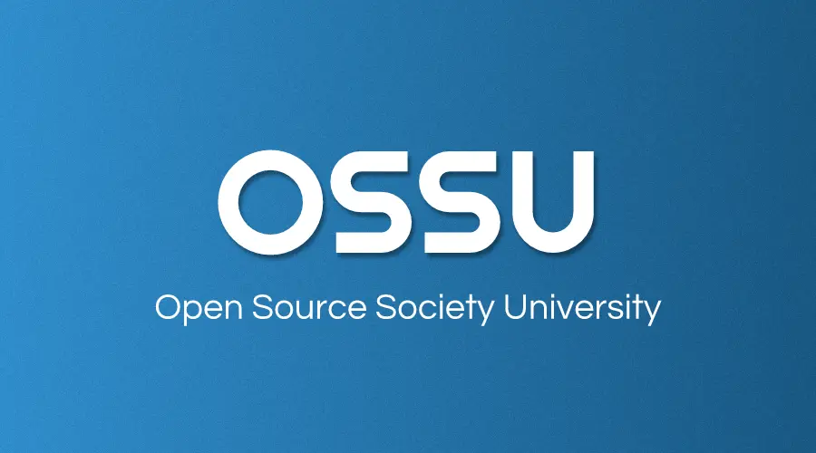

<h3>Open Source Society University</h3>

  컴퓨터 과학 무료 독학 교육 커리큘럼!

  
  

# 목차

- [요약](#요약)
- [커뮤니티](#커뮤니티)
- [커리큘럼](#커리큘럼)
- [행동 강령](#행동-강령)
- [팀](#팀)

# 요약

OSSU 커리큘럼은 온라인 자료를 활용한 **완벽한 컴퓨터 과학 교육**입니다.
단순히 직업 훈련이나 전문성 개발만을 위한 것이 아닙니다.
이 커리큘럼은 모든 컴퓨팅 분야의 기본이 되는 개념에 대해 *다방면으로* 탄탄한 기초를 원하며,
전 세계 학습자 커뮤니티의 지원을 받으면서 스스로 이 교육을 이수할 수 있는 규율, 의지, 그리고 (가장 중요한!) 좋은 습관을 가진 사람들을 위한 것입니다.

이 과정은 교양(비 CS) 요구 사항을 제외한 학부 컴퓨터 과학 전공의 학위 요구 사항에 맞춰 설계되었습니다.
이 커리큘럼을 따르는 대부분의 사람들은 이미 CS 분야 이외의 다른 교육을 받았다고 가정하기 때문입니다.
강좌 자체는 하버드, 프린스턴, MIT 등에서 제공하는 세계 최고 수준의 강의들이며,
다음 기준을 충족하도록 특별히 선별되었습니다.

**강좌 기준**:
- 수강 등록이 열려 있어야 합니다.
- 정기적으로 진행되어야 합니다(이상적으로는 자기 주도 형식이거나, 그렇지 않으면 1년에 여러 번 진행).
- 교육 자료와 교육학적 원칙에서 전반적으로 높은 품질을 유지해야 합니다.
- [CS 2013](CURRICULAR_GUIDELINES.md): 학부 컴퓨터 과학 학위 프로그램을 위한 커리큘럼 가이드라인의 커리큘럼 표준을 충족해야 합니다.

위의 기준을 충족하는 강좌가 없으면, 책으로 대체하여 수업을 보완합니다.
커리큘럼에 완벽하게 맞지는 않지만 양질의 강좌나 책이 있는 경우에는
[extras/courses](extras/courses.md) 또는 [extras/readings](extras/readings.md)에 포함됩니다.

**구성**. 커리큘럼은 다음과 같이 설계되었습니다:
- *Intro CS(입문 CS)*: 학생들이 CS를 시도해보고 자신에게 맞는지 확인할 수 있습니다.
- *Core CS(핵심 CS)*: 컴퓨터 과학 커리큘럼의 처음 3년에 대략 해당하며, 모든 전공자가 들어야 하는 필수 수업을 수강합니다.
- *Advanced CS(심화 CS)*: 컴퓨터 과학 커리큘럼의 마지막 연도에 대략 해당하며, 학생의 관심사에 따라 선택 과목을 수강합니다.
- *Final Project(최종 프로젝트)*: 학생들이 지식을 검증, 통합, 전시하고 전 세계 동료들의 평가를 받기 위한 프로젝트입니다.

**기간**. 신중하게 계획하고 주당 약 20시간을 투자한다면 약 2년 안에 완료할 수 있습니다. 수강생은 [이 스프레드시트](https://docs.google.com/spreadsheets/d/1y2kMsIg9VaHMVmw35x_aH1hpty3V-ZMuV2jA13P_Cgo/copy)를 사용하여 완료 예정일을 예측해볼 수 있습니다. 사본을 만든 후 `Timeline` 시트에 시작 날짜와 예상 주당 시간을 입력하세요. 강의를 수강하며 실제 강의 완료 날짜를 `Curriculum Data` 시트에 입력하면 업데이트된 예상 완료일을 얻을 수 있습니다.

> **경고:** 스프레드시트는 이 커리큘럼을 완료하는 데 필요한 시간을 추정하는 유용한 도구이지만, 항상 최신 커리큘럼을 반영하고 있는 것은 아닐 수 있습니다. 수강할 강좌를 확인하려면 반드시 [OSSU CS 웹사이트](https://cs.ossu.dev)나 [GitHub 저장소](https://github.com/ossu/computer-science)를 확인하세요.

**비용**. 모든 온라인 강의 자료는 무료이거나 거의 무료로 이용할 수 있습니다. 단, 일부 강좌에서는 채점을 받기 위해 과제/시험/프로젝트 제출 시 비용을 청구할 수도 있습니다.
[Coursera](https://www.coursera.support/s/article/209819033-Apply-for-Financial-Aid-or-a-Scholarship?language=en_US)와 [edX](https://courses.edx.org/financial-assistance/) 모두 재정 지원(Financial aid)을 제공하고 있다는 점을 참고하세요.

자신의 시간과 예산에 맞춰 비용을 얼마나 투자할지 자유롭게 결정하세요. 하지만 성공은 돈으로 살 수 없다는 점만 기억해 주세요!

**과정**. 수강생들은 커리큘럼을 혼자서 또는 그룹으로, 순서대로 혹은 순서에 상관없이 진행할 수 있습니다.
- 이미 학습한 내용이라고 확신하는 경우를 제외하고는 Core CS의 모든 강의를 수강하는 것을 권장합니다.
- 단순함을 위해, 과정(특히 Core CS)을 위에서 아래로 순서대로 진행하는 것을 권장합니다. 일부 학생들은 일/주간에 다루는 자료에 다양성을 주기 위해 여러 과목을 동시에 공부하기도 합니다. 인기 있는 방법은 입문 과정과 수리 과정을 병행하는 것입니다. 수강 과목의 선수 지식이 명시되어 있으니, 자신이 해당 강의를 들을 준비가 되었는지 판단하는 데 참고하세요.
- Advanced CS에 있는 강의들은 선택 과목입니다. 전문가가 되고 싶은 분야(예: 고급 프로그래밍)를 하나 골라서 해당 주제 아래의 모든 강의를 들으세요. 커스텀 주제를 직접 구상할 수도 있으며, Discord 커뮤니티에서 계획하신 주제에 대한 피드백을 받을 수 있습니다.

**콘텐츠 정책**. 공개적으로 자신의 과제물을 자랑할 계획이라면 허용된 파일들만 공유하셔야 합니다.
각 과정의 시작 부분에서 서명하신 *행동 강령을 준수*해 주세요!

**[기여하는 방법(How to contribute)](CONTRIBUTING.md)**

**[도움받기(Getting help)](HELP.md)** (자주 묻는 질문 및 채팅방 관련 안내)

# 커뮤니티

- Discord 서버가 있습니다!  OSSU 학생들과 소통하기 위해 이 곳을 가장 먼저 들러주세요. 지금 바로 자신을 소개해 보는 건 어떨까요? [OSSU Discord 가입하기](https://discord.gg/wuytwK5s9h)
- GitHub Issues를 통해서도 소통하실 수 있습니다. 강의에 문제가 있거나 커리큘럼에 수정이 필요한 경우 이곳에서 대화를 시작할 수 있습니다. 자세한 내용은 [여기](CONTRIBUTING.md)에서 읽어보세요.
- 귀하의 [Linkedin](https://www.linkedin.com/school/11272443/) 프로필에 **Open Source Society University**를 추가하세요!

:::{.callout-warning}
**경고:** OSSU를 검색하다 보면 일부 타사/더 이상 유지 보수되지 않거나 오래된 자료들을 찾을 수 있습니다. 이를 무시하시길 바라며 오직 [OSSU CS 웹사이트](https://cs.ossu.dev)나 [OSSU CS Github 저장소](https://github.com/ossu/computer-science)만을 이용하시기를 권장합니다. 알려진 오래된 자료는 다음과 같습니다:

 - 유지 보수되지 않고 중단된 firebase 앱. [FAQ](./FAQ.md#why-is-the-firebase-ossu-app-different-or-broken)에서 자세히 읽어보세요.
 - 유지 보수되지 않고 중단된 trello 보드
 - 타사 notion 템플릿
:::

# 커리큘럼

- [선수 지식](#선수-지식)
- [Intro CS (CS 입문)](#intro-cs-cs-입문)
- [Core CS (CS 핵심)](#core-cs-cs-핵심)
  - [핵심 프로그래밍](#핵심-프로그래밍)
  - [핵심 수학](#핵심-수학)
  - [CS 도구](#cs-도구)
  - [핵심 시스템](#핵심-시스템)
  - [핵심 이론](#핵심-이론)
  - [핵심 보안](#핵심-보안)
  - [핵심 애플리케이션](#핵심-애플리케이션)
  - [핵심 윤리](#핵심-윤리)
- [Advanced CS (CS 심화)](#advanced-cs-cs-심화)
  - [고급 프로그래밍](#고급-프로그래밍)
  - [고급 시스템](#고급-시스템)
  - [고급 이론](#고급-이론)
  - [고급 정보 보안](#고급-정보-보안)
  - [고급 수학](#고급-수학)
- [최종 프로젝트](#최종-프로젝트)

---

## 선수 지식

- [Core CS](#core-cs-cs-핵심)는 대수학, 기하학, 미적분학의 기초(pre-calculus)를 포함하여 학생이 이미 [고등학교 수학](https://ossu.dev/precollege-math) 과정을 수강했다고 가정합니다.
- [Advanced CS](#advanced-cs-cs-심화)는 학생이 이미 Core CS 전체를 수강했고, 어떤 선택 과목을 들을지 스스로 결정할 수 있을 만큼 충분한 지식이 있다고 가정합니다.
- 참고로 [고급 시스템(Advanced systems)](#고급-시스템)은 고등학교 AP 물리학 수준의 기초 물리학 강의를 수강했다고 가정합니다.

## Intro CS (CS 입문)

이 과정은 여러분을 컴퓨터 과학과 프로그래밍이라는 세계로 안내할 것입니다. 앞으로 배우게 될 학문에 대한 첫인상을 제공합니다. 강의를 다 듣고 더 깊이 파고들고 싶다면 컴퓨터 과학이 여러분의 적성에 딱 맞을 것입니다!

**주요 내용**:
`연산(computation)`
`명령형 프로그래밍(imperative programming)`
`기본 자료구조와 알고리즘`
`그 외`

강좌 | 기간 | 학습량 | 선수 지식 | 토론 시간
:-- | :--: | :--: | :--: | :--:
[파이썬을 활용한 컴퓨터 과학 및 프로그래밍 입문](coursepages/intro-cs/README.md) | 14주 | 주 6-10시간 | [고등학교 대수학](https://ossu.dev/precollege-math) | [채팅방](https://discord.gg/jvchSm9)

## Core CS (CS 핵심)

별도로 표기된 경우를 제외하고는 Core CS 아래의 모든 공고된 강의 내용은 **필수 과정**입니다.

### 핵심 프로그래밍
**주요 내용**:
`함수형 프로그래밍`
`테스트를 고려한 설계`
`프로그램 요구사항`
`공통 디자인 패턴`
`단위 테스트`
`객체 지향 설계`
`정적 타입 지정`
`동적 타입 지정`
`ML 계열 언어 (Standard ML을 통해)`
`Lisp 계열 언어 (Racket을 통해)`
`Ruby`
`그 외`

강좌 | 기간 | 학습량 | 선수 지식 | 토론 시간
:-- | :--: | :--: | :--: | :--:
[체계적인 프로그램 설계(Systematic Program Design)](coursepages/spd/README.md) | 13주 | 주 8-10시간 | 없음 | 채팅: [파트 1](https://discord.gg/RfqAmGJ) / [파트 2](https://discord.gg/kczJzpm)
[클래스 기반 프로그램 설계(Class-based Program Design)](https://course.ccs.neu.edu/cs2510sp22/index.html) | 13주 | 주 5-10시간 | Systematic Program Design, 고등학교 수학 | [채팅방](https://discord.com/channels/744385009028431943/891411727294562314)
[프로그래밍 언어(Programming Languages)](https://courses.cs.washington.edu/courses/cse341/19sp/#lectures) | 11주 | 주 4-8시간 | Systematic Program Design | [채팅방](https://discord.gg/8BkJtXN)
[객체 지향 설계(Object-Oriented Design)](https://course.ccs.neu.edu/cs3500f19/) | 13주 | 주 5-10시간 | Class Based Program Design | [채팅방](https://discord.com/channels/744385009028431943/891412022120579103)
[소프트웨어 아키텍처(Software Architecture)](https://www.coursera.org/learn/software-architecture) | 4주 | 주 2-5시간 | Object Oriented Design | [채팅방](https://discord.com/channels/744385009028431943/891412169638432788)

### 핵심 수학
이산 수학(CS 수학)은 사전 필수 지식이자 알고리즘 및 자료 구조 연구와 밀접하게 연관되어 있습니다. 미적분학은 이산 수학을 준비할 수 있게 도우며 수학적 성숙도를 향상시킬 수 있도록 도와줍니다.

**주요 내용**:
`이산 수학`
`수학적 증명`
`기초 통계학`
`빅오(O) 표기법`
`이산 확률`
`그 외`

강좌 | 기간 | 학습량 | 비고 | 선수 지식 | 토론 시간
:-- | :--: | :--: | :--: | :--: | :--:
[미적분학 1A: 미분(Calculus 1A: Differentiation)](https://openlearninglibrary.mit.edu/courses/course-v1:MITx+18.01.1x+2T2019/about) ([대체](https://ocw.mit.edu/courses/mathematics/18-01sc-single-variable-calculus-fall-2010/index.htm)) | 13주 | 주 6-10시간 | 대체 강의는 이 강의와 이어서 진행할 2개의 강의를 포함합니다. | [고등학교 수학](https://ossu.dev/precollege-math) | [채팅방](https://discord.gg/mPCt45F)
[미적분학 1B: 적분(Calculus 1B: Integration)](https://openlearninglibrary.mit.edu/courses/course-v1:MITx+18.01.2x+3T2019/about) | 13주 | 주 5-10시간 | - | Calculus 1A | [채팅방](https://discord.gg/sddAsZg)
[미적분학 1C: 좌표계 및 무한급수(Calculus 1C: Coordinate Systems & Infinite Series)](https://openlearninglibrary.mit.edu/courses/course-v1:MITx+18.01.3x+1T2020/about) | 6주 | 주 5-10시간 | - | Calculus 1B | [채팅방](https://discord.gg/FNEcNNq)
[컴퓨터 과학을 위한 수학(Mathematics for Computer Science)](https://openlearninglibrary.mit.edu/courses/course-v1:OCW+6.042J+2T2019/about) ([대체](https://ocw.mit.edu/courses/6-042j-mathematics-for-computer-science-fall-2010/)) | 13주 | 주 5시간 | [2015/2019 문제풀이](https://github.com/spamegg1/Math-for-CS-solutions) [2010 문제풀이](https://github.com/frevib/mit-cs-math-6042-fall-2010-problems) [2005 문제풀이](https://ocw.mit.edu/courses/electrical-engineering-and-computer-science/6-042j-mathematics-for-computer-science-fall-2005/assignments/). | Calculus 1C | [채팅방](https://discord.gg/EuTzNbF)

### CS 도구
이론에 대한 이해도 중요하지만 결국 프로그램을 만들어야 합니다. 프로그래밍 과정을 더 쉽게 만들어주는 다양한 도구들이 널리 쓰이고 있습니다. 이 과정을 이수하여 향후 프로그램 작성을 더욱 원활하게 진행하세요.

**주요 내용**:
`터미널 및 셸 스크립팅`
`vim`
`명령줄 통합 환경`
`버전 관리`
`그 외`

강좌 | 기간 | 학습량 | 선수 지식 | 토론 시간
:-- | :--: | :--: | :--: | :--:
[CS 교육에서 놓친 한 학기(The Missing Semester of Your CS Education)](https://missing.csail.mit.edu/) | 2주 | 주 12시간 | - | [채팅방](https://discord.gg/5FvKycS)

### 핵심 시스템

**주요 내용**:
`절차적 프로그래밍`
`수동 메모리 관리`
`불 대수`
`논리 게이트`
`메모리`
`컴퓨터 아키텍처`
`어셈블리`
`기계어`
`가상 머신`
`고급 언어`
`컴파일러`
`운영 체제`
`네트워크 프로토콜`
`그 외`

강좌 | 기간 | 학습량 | 부가 자료/과제 | 선수 지식 | 토론 시간
:-- | :--: | :--: | :--: | :--: | :--:
[기초부터 현대 컴퓨터 구축하기: 낸드에서 테트리스까지 (Nand to Tetris Part 1)](https://www.coursera.org/learn/build-a-computer) ([대체](https://www.nand2tetris.org/)) | 6주 | 주 7-13시간 | - | C 유사 프로그래밍 언어 | [채팅방](https://discord.gg/vxB2DRV)
[기초부터 현대 컴퓨터 구축하기: 낸드에서 테트리스까지 파트 2(Nand to Tetris Part II )](https://www.coursera.org/learn/nand2tetris2) | 6주 | 주 12-18시간 | - | [이 프로그래밍 언어 중 하나](https://user-images.githubusercontent.com/2046800/35426340-f6ce6358-026a-11e8-8bbb-4e95ac36b1d7.png), Nand to Tetris Part 1 | [채팅방](https://discord.gg/AsUXcPu)
[운영 체제: 세 가지 쉬운 조각(Operating Systems: Three Easy Pieces)](coursepages/ostep/README.md) | 10-12주 | 주 6-10시간 | - | Nand to Tetris Part II | [채팅방](https://discord.gg/wZNgpep)
[컴퓨터 네트워킹: 하향식 접근(Computer Networking: a Top-Down Approach)](http://gaia.cs.umass.edu/kurose_ross/online_lectures.htm)| 8주 | 주 4–12시간 | [Wireshark 연구소](http://gaia.cs.umass.edu/kurose_ross/wireshark.php) | 대수학, 확률, 기본 CS | [채팅방](https://discord.gg/MJ9YXyV)

### 핵심 이론

**주요 내용**:
`분할 정복`
`정렬 및 탐색`
`무작위 알고리즘`
`그래프 탐색`
`최단 경로`
`자료 구조`
`탐욕 알고리즘`
`최소 신장 트리`
`동적 프로그래밍`
`NP 완전성`
`그 외`

강좌 | 기간 | 학습량 | 선수 지식 | 토론 시간
:-- | :--: | :--: | :--: | :--:
[알고리즘: 설계 및 분석 파트 1](https://www.edx.org/learn/algorithms/stanford-university-algorithms-design-and-analysis-part-1) ([대체](https://www.algorithmsilluminated.org/)) | 8주 | 주 4-8시간 | 프로그래밍 언어 1가지 이상, Mathematics for Computer Science | [채팅방](https://discord.gg/mKRS7tY)
[알고리즘: 설계 및 분석 파트 2](https://www.edx.org/learn/algorithms/stanford-university-algorithms-design-and-analysis-part-2) | 8주 | 주 4-8시간 | 알고리즘 파트 1 | [채팅방](https://discord.gg/Qstqe4t)

### 핵심 보안
**주요 내용**
`기밀성, 무결성, 가용성 (CIA 삼원칙)`
`보안 설계`
`방어적 프로그래밍`
`위협 및 공격`
`네트워크 보안`
`암호학`
`그 외`

강좌 | 기간 | 학습량 | 선수 지식 | 토론 시간
:-- | :--: | :--: | :--: | :--:
[사이버보안 기초(Cybersecurity Fundamentals)](https://www.edx.org/learn/cybersecurity/rochester-institute-of-technology-cybersecurity-fundamentals) | 8주 | 주 10-12시간 | - | [채팅방](https://discord.gg/XdY3AwTFK4)
[안전한 코딩의 원칙(Principles of Secure Coding)](https://www.coursera.org/learn/secure-coding-principles)| 4주 | 주 4시간 | - | [채팅방](https://discord.gg/5gMdeSK)
[보안 취약점 식별(Identifying Security Vulnerabilities)](https://www.coursera.org/learn/identifying-security-vulnerabilities) | 4주 | 주 4시간 | - | [채팅방](https://discord.gg/V78MjUS)

다음 중 **하나**를 선택하세요:

강좌 | 기간 | 학습량 | 선수 지식 | 토론 시간
:-- | :--: | :--: | :--: | :--:
[C/C++ 프로그래밍에서 보안 취약점 식별](https://www.coursera.org/learn/identifying-security-vulnerabilities-c-programming) | 4주 | 주 5시간 | - | [채팅방](https://discord.gg/Vbxce7A)
[Java 애플리케이션 보안 취약점 식별 및 보안](https://www.coursera.org/learn/exploiting-securing-vulnerabilities-java-applications) | 4주 | 주 5시간 | - | [채팅방](https://discord.gg/QxC22rR)

### 핵심 애플리케이션

**주요 내용**:
`애자일(Agile) 방법론`
`REST`
`소프트웨어 사양(specifications)`
`리팩토링(refactoring)`
`관계형 데이터베이스`
`트랜잭션(transaction) 처리`
`데이터 모델링`
`인경 신경망`
`지도 학습(supervised learning)`
`비지도 학습(unsupervised learning)`
`OpenGL`
`레이 트레이싱(ray tracing)`
`그 외`

강좌 | 기간 | 학습량 | 선수 지식 | 토론 시간
:-- | :--: | :--: | :--: | :--:
[데이터베이스: 모델링 및 이론](https://www.edx.org/learn/databases/stanford-university-databases-modeling-and-theory)| 2주 | 주 10시간 | 핵심 프로그래밍 | [채팅방](https://discord.gg/pMFqNf4)
[데이터베이스: 관계형 데이터베이스 및 SQL](https://www.edx.org/learn/relational-databases/stanford-university-databases-relational-databases-and-sql)| 2주 | 주 10시간 | 핵심 프로그래밍 | [채팅방](https://discord.gg/P8SPPyF)
[데이터베이스: 반정형(Semistructured) 데이터](https://www.edx.org/learn/relational-databases/stanford-university-databases-semistructured-data)| 2주 | 주 10시간 | 핵심 프로그래밍 | [채팅방](https://discord.gg/duCJ3GN)
[기계 학습(Machine Learning)](https://www.deeplearning.ai/courses/machine-learning-specialization/)| 11주 | 주 9시간 | 기초 프로그래밍 | [채팅방](https://discord.gg/NcXHDjy)
[컴퓨터 그래픽스(Computer Graphics)](https://www.edx.org/learn/computer-graphics/the-university-of-california-san-diego-computer-graphics) ([대체](https://cseweb.ucsd.edu/~viscomp/classes/cse167/wi22/schedule.html))| 6주 | 주 12시간 | C++ 또는 Java, [기초 선형대수학](https://ossu.dev/precollege-math/coursepages/precalculus) | [채팅방](https://discord.gg/68WqMNV)
[소프트웨어 엔지니어링 개론(Software Engineering: Introduction)](https://www.edx.org/learn/software-engineering/university-of-british-columbia-software-engineering-introduction) ([대체](https://github.com/ubccpsc/310/blob/main/resources/README.md)) | 6주 | 주 8-10시간 | 핵심 프로그래밍 및 [규모 있는 프로젝트 경험](FAQ.md#why-require-experience-with-a-sizable-project-before-the-Software-Engineering-courses) | [채팅방](https://discord.gg/5Qtcwtz)

### 핵심 윤리

**주요 내용**:
`사회적 맥락(Social Context)`
`분석 도구(Analytical Tools)`
`직업 윤리(Professional Ethics)`
`지식재산권(Intellectual Property)`
`프라이버시와 시민의 자유(Privacy and Civil Liberties)`
`그 외`

강좌 | 기간 | 학습량 | 선수 지식 | 토론 시간
:-- | :--: | :--: | :--: | :--:
[기술과 엔지니어링의 윤리(Ethics, Technology and Engineering)](https://www.coursera.org/learn/ethics-technology-engineering)| 9주 | 주 2시간 | 없음 | [채팅방](https://discord.gg/6ttjPmzZbe)
[지식 재산권 개론(Introduction to Intellectual Property)](https://www.coursera.org/learn/introduction-intellectual-property)| 4주 | 주 2시간 | 없음 | [채팅방](https://discord.gg/YbuERswpAK)
[데이터 프라이버시 기초(Data Privacy Fundamentals)](https://www.coursera.org/learn/northeastern-data-privacy)| 3주 | 주 3시간 | 없음 | [채팅방](https://discord.gg/64J34ajNBd)

## Advanced CS (CS 심화)

Core CS의 **모든 필수 과정**을 마친 후, 관심사에 따라 Advanced CS에서 원하는 과정을 수강할 수 있습니다.
한 세부 항목의 모든 과정을 이수해야 하는 것은 아닙니다.
다만 자신이 희망하는 특정 분야와 관련된 강의는 *전부* 수강할 것을 권장합니다.

### 고급 프로그래밍

**주요 내용**:
`디버깅 이론 및 실습`
`목표 지향형 프로그래밍`
`병렬 컴퓨팅`
`객체 지향 분석 및 설계`
`UML`
`대규모 소프트웨어 아키텍처 및 설계`
`그 외`

강좌 | 기간 | 학습량 | 선수 지식
:-- | :--: | :--: | :--:
[병렬 프로그래밍(Parallel Programming)](https://www.coursera.org/learn/scala-parallel-programming)| 4주 | 주 6-8시간 | Scala 프로그래밍
[컴파일러(Compilers)](https://www.edx.org/learn/computer-science/stanford-university-compilers) | 9주 | 주 6-8시간 | 없음
[하스켈 입문(Introduction to Haskell)](https://www.seas.upenn.edu/~cis194/fall16/)| 14주 | - | -
[프롤로그 완전 정복!(Learn Prolog Now!)](https://www.let.rug.nl/bos/lpn//lpnpage.php?pageid=online) ([대체](https://github.com/ossu/computer-science/files/6085884/lpn.pdf))*| 12주 | - | -
[소프트웨어 디버깅(Software Debugging)](https://www.youtube.com/playlist?list=PLAwxTw4SYaPkxK63TiT88oEe-AIBhr96A)| 8주 | 주 6시간 | 파이썬, 객체지향 프로그래밍
[소프트웨어 테스팅(Software Testing)](https://www.youtube.com/playlist?list=PLAwxTw4SYaPkWVHeC_8aSIbSxE_NXI76g) | 4주 | 주 6시간 | 파이썬, 기본적인 프로그래밍 경험

(*) Blackburn, Bos, Striegnitz 저서 ([저작물 출처](https://github.com/LearnPrologNow/lpn), [CC 라이선스](https://creativecommons.org/licenses/by-sa/4.0/)로 배포됨)

### 고급 시스템

**주요 내용**:
`디지털 신호(digital signaling)`
`조합 논리회로(combinational logic)`
`CMOS 기술`
`순차 논리회로(sequential logic)`
`상태 머신(finite state machines)`
`프로세서 명령어 집합`
`캐시(caches)`
`파이프라이닝(pipelining)`
`가상화(virtualization)`
`병렬 처리(parallel processing)`
`가상 메모리`
`동기화 프리미티브(synchronization primitives)`
`시스템 호출 인터페이스`
`그 외`

강좌 | 기간 | 학습량 | 선수 지식 | 비고
:-- | :--: | :--: | :--: | :--:
[계산 구조 1: 디지털 회로(Computation Structures 1: Digital Circuits)](https://learning.edx.org/course/course-v1:MITx+6.004.1x_3+3T2016) [대체 1](https://ocw.mit.edu/courses/6-004-computation-structures-spring-2017/) [대체 2](https://ocw.mit.edu/courses/6-004-computation-structures-spring-2009/) | 10주 | 주 6시간 | [Nand2Tetris II](https://www.coursera.org/learn/nand2tetris2) | 대체 링크는 전체 3과목을 포함합니다.
[계산 구조 2: 컴퓨터 아키텍처(Computation Structures 2: Computer Architecture)](https://learning.edx.org/course/course-v1:MITx+6.004.2x+3T2015) | 10주 | 주 6시간 | 계산 구조 1 | - 
[계산 구조 3: 컴퓨터 구조(Computation Structures 3: Computer Organization)](https://learning.edx.org/course/course-v1:MITx+6.004.3x_2+1T2017) | 10주 | 주 6시간 | 계산 구조 2 | -

### 고급 이론

**주요 내용**:
`형식 언어(formal languages)`
`튜링 머신(Turing machines)`
`계산 가능성(computability)`
`이벤트 중심 동시성(event-driven concurrency)`
`오토마타(automata)`
`분산 공유 메모리(distributed shared memory)`
`합의 알고리즘(consensus algorithms)`
`상태 기계 복제(state machine replication)`
`계산 기하학 이론(computational geometry theory)`
`명제 논리(propositional logic)`
`관계 논리(relational logic)`
`허브랜드 논리(Herbrand logic)`
`게임 트리(game trees)`
`그 외`

강좌 | 기간 | 학습량 | 선수 지식
:-- | :--: | :--: | :--:
[계산 이론(Theory of Computation)](https://ocw.mit.edu/courses/18-404j-theory-of-computation-fall-2020/) ([대체](https://www.youtube.com/playlist?list=PLEE7DF8F5E0203A56)) | 13주 | 주 10시간 | [Mathematics for Computer Science](https://openlearninglibrary.mit.edu/courses/course-v1:OCW+6.042J+2T2019/about), 논리고학, 알고리즘
[계산 기하학(Computational Geometry)](https://www.edx.org/learn/geometry/tsinghua-university-ji-suan-ji-he-computational-geometry) | 16주 | 주 8시간 | 알고리즘, C++
[게임 이론(Game Theory)](https://www.coursera.org/learn/game-theory-1) | 8주 | 주 3시간 | 수학적 사고, 확률, 미적분학

### 고급 정보 보안

강좌 | 기간 | 학습량 | 선수 지식
:-- | :--: | :--: | :--:
[웹 보안 입문(Web Security Fundamentals)](https://www.edx.org/learn/computer-security/ku-leuven-web-security-fundamentals) | 5주 | 주 4-6시간 | 기본 웹 기술 이해
[보안 거버넌스 및 규정 준수(Security Governance & Compliance)](https://www.coursera.org/learn/security-governance-compliance) | 3주 | 주 3시간 | -
[디지털 포렌식 개념(Digital Forensics Concepts)](https://www.coursera.org/learn/digital-forensics-concepts) | 3주 | 주 2-3시간 | 핵심 보안
[안전한 소프트웨어 개발: 요구사항, 설계 및 재사용(Secure Software Development)](https://www.edx.org/learn/software-development/the-linux-foundation-secure-software-development-requirements-design-and-reuse) | 7주 | 주 1-2시간 | 핵심 프로그래밍 및 핵심 보안
[안전한 소프트웨어 개발: 구현(Secure Software Development: Implementation)](https://www.edx.org/learn/software-development/the-linux-foundation-secure-software-development-implementation) | 7주 | 주 1-2시간 | 안전한 소프트웨어 개발: 요구사항, 설계 및 재사용
[안전한 소프트웨어 개발: 검증 및 세부 주제(Secure Software Development: Verification and More Specialized Topics)](https://www.edx.org/learn/software-engineering/the-linux-foundation-secure-software-development-verification-and-more-specialized-topics) | 7주 | 주 1-2시간 | 안전한 소프트웨어 개발: 구현

### 고급 수학

강좌 | 기간 | 학습량 | 선수 지식 | 토론 시간
:-- | :--: | :--: | :--: | :--:
[선형 대수학의 본질(Essence of Linear Algebra)](https://www.youtube.com/playlist?list=PLZHQObOWTQDPD3MizzM2xVFitgF8hE_ab) | - | - | [고등학교 수학](https://ossu.dev/precollege-math) | [채팅방](https://discord.gg/m6wHbP6)
[선형 대수학(Linear Algebra)](https://ocw.mit.edu/courses/mathematics/18-06sc-linear-algebra-fall-2011/) | 14주 | 주 12시간 | 동시 수강 권장: 선형 대수학의 본질 | [채팅방](https://discord.gg/k7nSWJH)
[수치 계산 입문(Introduction to Numerical Methods)](https://ocw.mit.edu/courses/mathematics/18-335j-introduction-to-numerical-methods-spring-2019/index.htm)| 14주 | 주 12시간 | [선형 대수학](https://ocw.mit.edu/courses/mathematics/18-06sc-linear-algebra-fall-2011/) | [채팅방](https://discord.gg/FNEcNNq)
[형식 논리학 서론(Introduction to Formal Logic)](https://forallx.openlogicproject.org/) | 10주 | 주 4-8시간 | [집합론 (Set Theory)](https://www.youtube.com/playlist?list=PL5KkMZvBpo5AH_5GpxMiryJT6Dkj32H6N) | [채팅방](https://discord.gg/MbM2Gg5)
[확률론(Probability)](https://stat110.hsites.harvard.edu/) | 15주 | 주 5-10시간 | [미적분학 1B (Differentiation and Integration)](https://www.edx.org/course/calculus-1b-integration) | [채팅방](https://discord.gg/UVjs9BU)

## 최종 프로젝트

무언가를 배우는 과정에는 반드시 실행이 필요합니다.
학습했던 모든 과정의 과제와 실습은 실생활의 문제들을 해결하는 방법을 터득하기 위해 주어졌을 뿐입니다.

Core CS와 여러분의 관심 분야에 맞춘 Advanced CS 과정들을 마쳤다면 여러분이 배운 지식으로
어떤 문제들을 해결할 수 있는지 파악하고 응용해 보세요.
완전하게 새로운 프로젝트를 만들거나 기존에 있던 다른 프로그램/도구의 코드를 개선하셔도 좋습니다.

프로젝트 구상에 도움이 필요하시다면 다음 소개된 프로젝트 실습/가이드라인 강좌를 권장합니다.
(수강 과정을 무사히 통과하신 분이라면 다음 소개된 목록 중에 자신의 흥미와 관련된 것이 무엇인지 찾으실 수 있을 것입니다):

강좌 | 기간 | 학습량 | 선수 지식
:-- | :--: | :--: | :--:
[풀스택 오픈(Fullstack Open)](https://fullstackopen.com/en/) | 12주 | 주 15시간 | 프로그래밍
[현대 로봇 공학(Modern Robotics)](https://modernrobotics.northwestern.edu) | 26주 | 주 2-5시간 | 1학년 수준 기초 물리학, 선형대수학, 미적분학, [선형 상미분방정식](https://www.khanacademy.org/math/differential-equations)
[데이터 마이닝 (Data Mining Specialization)](https://www.coursera.org/specializations/data-mining) | 30주 | 주 2-5시간 | 기계 학습 (Machine Learning)
[빅 데이터 (Big Data Specialization)](https://www.coursera.org/specializations/big-data) | 30주 | 주 3-5시간 | -
[사물 인터넷 (Internet of Things Specialization)](https://www.coursera.org/specializations/internet-of-things) | 30주 | 주 1-5시간 | 심화 프로그래밍 (Strong programming)
[클라우드 컴퓨팅 (Cloud Computing Specialization)](https://www.coursera.org/specializations/cloud-computing) | 30주 | 주 2-6시간 | C++ 프로그래밍
[데이터 과학 (Data Science Specialization)](https://www.coursera.org/specializations/jhu-data-science) | 43주 | 주 1-6시간 | -
[스칼라 함수형 프로그래밍 (Functional Programming in Scala)](https://www.coursera.org/specializations/scala) | 29주 | 주 4-5시간 | 코딩 경력 1년 이상
[유니티 게임 설계 및 개발 (Game Design and Development with Unity 2020)](https://www.coursera.org/specializations/game-design-and-development) | 6개월 | 주 5시간 | 프로그래밍, 인터랙티브(interactive) 설계 지식

## 축하합니다

여태까지 배운 커리큘럼 과정을 완수한 여러분은,
컴퓨터 과학 학사 학위 수준의 지식을 모두 습득하셨습니다.
진심으로 축하합니다!

이제 배운 것들을 활용해 볼 시간입니다. 아래 나열된 가능성 모두에 도전하셔도 좋습니다:

- 소프트웨어 개발자 취업 준비!
- 더 많은 실력을 갈고닦고 싶다면 개발자를 위한 [고전 필독서](extras/readings.md) 목록을 확인해 보세요.
- 지역 개발자 모임에 참석해 보세요. (예: [meetup.com](https://www.meetup.com/))
- 세계적으로 떠오르는 새로운 소프트웨어 기술 동향을 파악해 보세요:
  + 얼랭(Erlang) 가상 머신에 기반해 탄생한 웹 함수형 프로그래밍 언어 [엘릭서(Elixir)](https://elixir-lang.org/)를 통해 **행위자 모델(actor model)**을 탐구해 보세요!
  + 가비지 컬렉터 없이 멀티 스레드 제어와 메모리 주소값 할당의 안전을 제공하는 시스템 프로그래밍 언어 [러스트(Rust)](https://www.rust-lang.org/)를 통해 **소유권 차용 및 수명(borrowing and lifetimes)**을 탐구해 보세요!
  + 타입 기반 개발을 완벽하게 지원하는 하스켈(Haskell)에서 영감을 받은 언어 [이드리스(Idris)](https://www.idris-lang.org/)를 통해 **종속성 타입 시스템(dependent type systems)**을 탐구해 보세요.

# 행동 강령
[OSSU의 행동 강령(code of conduct)을 확인해주세요](https://github.com/ossu/code-of-conduct).

## 진행 상황을 공유하는 방법

이 [GitHub 저장소](https://github.com/ossu/computer-science)를 여러분의 계정으로 [포크(Fork)](https://www.freecodecamp.org/news/how-to-fork-a-github-repository/)하고 진도에 맞춰 완료한 내용은 ✅로 표기해 보세요. 이것이 여러분만의 작고 소중한 [칸반(Kanban) 보드](https://en.wikipedia.org/wiki/Kanban_board)가 되리라 믿습니다. 동시에 어떤 다른 방법보다 직관적이고 시간을 절약해 줄 것입니다. (절약된 시간을 모두 강의를 듣는데 집중하세요!)

# 팀

* **[Eric Douglas](https://github.com/ericdouglas)**: OSSU 설립자
* **[Josh Hanson](https://github.com/joshmhanson)**: 수석 기술 유지 보수 관리자
* **[Waciuma Wanjohi](https://github.com/waciumawanjohi)**: 수석 학사 유지 보수 관리자
* **[기여자들](https://github.com/ossu/computer-science/graphs/contributors)**
